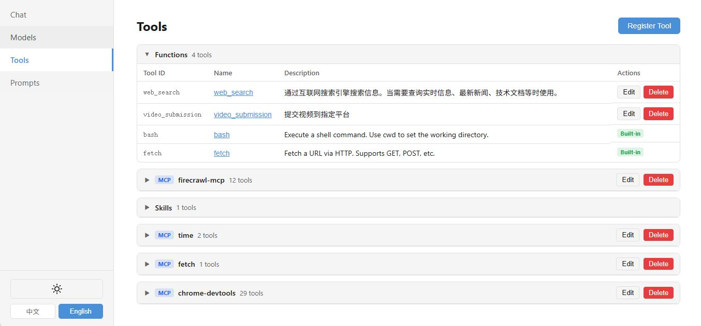
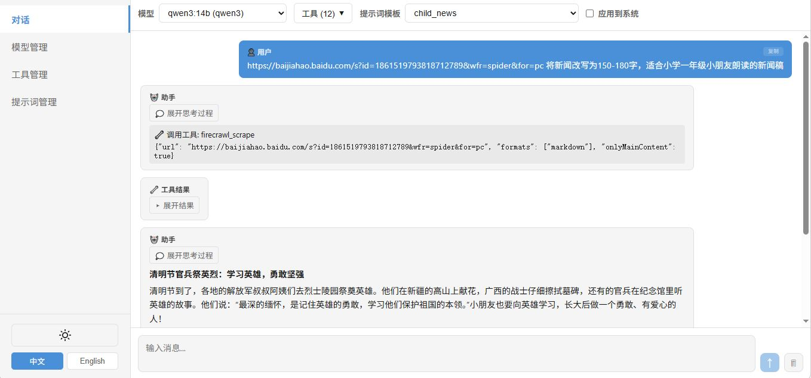

# Composable Agent Runtime

[English](#english) | [中文](#中文)

---

<a name="english"></a>

## English

A minimal, zero-dependency composable agent runtime engine built with pure Python standard library. Dynamically compose any LLM with any combination of tools (Function, MCP, Skill) at runtime — no static agent definitions needed.

### Features

- **Zero third-party dependencies** — core runtime uses only Python standard library
- **Multi-protocol support** — OpenAI-compatible API and Ollama native `/api/chat`
- **Three tool types** — in-process Function tools, MCP (Model Context Protocol) tools, and Skills
- **Direct MCP/function tool invocation** — bypass the LLM and call MCP/function tools directly, 100% reliability
- **Skill progressive disclosure** — first round exposes only skill summary; full `SKILL.md` is injected only when the model selects the skill
- **Streaming inference** — real-time token streaming with thinking/reasoning content support
- **Web UI management console** — Svelte 5 SPA for managing models, tools, prompt templates, and chat
- **HTTP API server** — lightweight REST API built on `http.server`, no FastAPI/uvicorn needed
- **Multimodal** — supports image (base64) and audio inputs for VLM models

### Architecture

```
runtime/
├── __init__.py              # Public API exports
├── models.py                # Data models: Message, ModelConfig, ToolConfig, etc.
├── registry.py              # ModelRegistry + ToolRegistry
├── protocols.py             # Protocol adapters: OpenAI / Ollama
├── runtime.py               # Runtime engine: inference + tool call loop + Skill disclosure
├── tools.py                 # Function tool decorator
├── skill_manager.py         # SkillManager: SKILL.md parsing and progressive disclosure
├── mcp_client.py            # MCP Client: pure stdlib stdio/SSE implementation
├── builtin_tools.py         # Built-in tools: bash, fetch
├── prompt_template_manager.py  # Prompt template CRUD
└── server.py                # HTTP API server

web/                         # Svelte 5 management console SPA
examples/                    # Usage examples
```

### Quick Start

**1. Python API — Function Tool**

```python
from runtime import (
    ModelConfig, ModelRegistry,
    ToolConfig, ToolRegistry,
    Runtime, InferenceRequest, Message,
)

# Register a model
model_registry = ModelRegistry()
model_registry.register(ModelConfig(
    model_id="qwen3-14b",
    api_base="http://localhost:11434",
    model_name="qwen3:14b",
    api_protocol="ollama",
))

# Register a function tool
tool_registry = ToolRegistry()
tool_registry.register(
    ToolConfig(
        tool_id="web_search",
        tool_type="function",
        name="web_search",
        description="Search the internet for information.",
        parameters={
            "type": "object",
            "properties": {
                "query": {"type": "string", "description": "Search query"},
            },
            "required": ["query"],
        },
    ),
    callable_fn=my_search_function,
)

# Run inference
runtime = Runtime(model_registry=model_registry, tool_registry=tool_registry)
result = runtime.infer(InferenceRequest(
    model_id="qwen3-14b",
    tool_ids=["web_search"],
    messages=[Message(role="user", content="What is the latest Python version?")],
))
print(result.messages[-1].content)
```

**2. MCP Tools**

```python
from runtime import ModelRegistry, ToolRegistry, Runtime, InferenceRequest
from runtime.mcp_client import MCPClientManager

mcp = MCPClientManager()
mcp.load_config({
    "mcpServers": {
        "time": {"command": "uvx", "args": ["mcp-server-time"]},
        "fetch": {"command": "uvx", "args": ["mcp-server-fetch"]},
    }
})

tool_registry = ToolRegistry()
all_tools = []
for server_name in ["time", "fetch"]:
    tools = mcp.get_tools(server_name)
    for t in tools:
        tool_registry.register(t)
    all_tools.extend(tools)

runtime = Runtime(model_registry=..., tool_registry=tool_registry, mcp_manager=mcp)
result = runtime.infer(InferenceRequest(
    model_id="my-model",
    tool_ids=[t.tool_id for t in all_tools],
    text="What time is it now?",
))
```

**3. Skill with Progressive Disclosure**

```python
from runtime import ModelRegistry, ToolRegistry, Runtime, InferenceRequest, SkillManager

tool_registry = ToolRegistry()
skill_manager = SkillManager(tool_registry)
skill_config = skill_manager.load_skill("/path/to/my_skill")  # directory with SKILL.md

runtime = Runtime(
    model_registry=...,
    tool_registry=tool_registry,
    skill_manager=skill_manager,
)

# Stream with progressive disclosure
for msg in runtime.infer_stream(InferenceRequest(
    model_id="my-model",
    tool_ids=[skill_config.tool_id],
    text="Help me query the latest data",
    max_tool_rounds=10,
)):
    if msg.content:
        print(msg.content, end="", flush=True)
    elif msg.thinking:
        print(f"[thinking] {msg.thinking}", end="", flush=True)
```

**4. SKILL.md Format**

```markdown
---
name: my_skill
description: A skill for querying and managing data via the platform API.
---

# My Skill

## API Reference

### Query Data
```bash
curl -X POST http://api.example.com/data/query \
  -H "Content-Type: application/json" \
  -d '{"page": 1, "size": 10}'
```
```

**5. Start the HTTP Server**

```python
from runtime import RuntimeHTTPServer, Runtime, ModelRegistry, ToolRegistry

runtime = Runtime(model_registry=ModelRegistry(), tool_registry=ToolRegistry())
server = RuntimeHTTPServer(runtime, host="0.0.0.0", port=8080)
server.start()
```

Or from the command line:

```bash
python -m runtime.server
```

### HTTP API Reference

| Method | Path | Description |
|--------|------|-------------|
| POST | `/v1/infer` | Non-streaming inference |
| POST | `/v1/infer/stream` | Streaming inference (SSE) |
| GET | `/v1/models` | List registered models |
| POST | `/v1/models` | Register a model |
| PUT | `/v1/models/{model_id}` | Update a model |
| DELETE | `/v1/models/{model_id}` | Delete a model |
| GET | `/v1/tools` | List registered tools |
| POST | `/v1/tools` | Register a tool |
| PUT | `/v1/tools/{tool_id}` | Update a tool |
| DELETE | `/v1/tools/{tool_id}` | Delete a tool |
| POST | `/v1/tools/call` | Directly call a tool (bypass LLM) |
| POST | `/v1/tools/mcp` | Register MCP servers |
| POST | `/v1/tools/skill` | Register a skill |
| GET | `/v1/prompt-templates` | List prompt templates |
| POST | `/v1/prompt-templates` | Create a prompt template |
| PUT | `/v1/prompt-templates/{id}` | Update a prompt template |
| DELETE | `/v1/prompt-templates/{id}` | Delete a prompt template |

**Streaming inference request:**

```json
{
  "model_id": "qwen3-14b",
  "tool_ids": ["web_search"],
  "messages": [
    {"role": "system", "content": "You are a helpful assistant."},
    {"role": "user", "content": "Search for the latest AI news."}
  ],
  "stream": true,
  "max_tool_rounds": 10
}
```

### Web UI



The management console is a Svelte 5 SPA located in `web/`. Build and serve it:

```bash
cd web
npm install
npm run build
```

The built files in `web/dist/` are automatically served by the HTTP server at the root path.

Features:
- Chat with model selection, tool selection, and prompt template support
- Model management (CRUD)
- Tool management (CRUD)
- Prompt template management with `{placeholder}` variable support
- Markdown rendering with syntax highlighting
- Multimodal: image upload and microphone recording
- Dark/light theme, responsive layout

### Examples

| File | Description |
|------|-------------|
| `examples/example_function_register.py` | Register a SearXNG search as a Function Tool; the LLM automatically calls it to answer queries |
| `examples/example_mcp_ollama.py` | Connect Ollama (qwen3:14b) with MCP `time` and `fetch` servers; supports `--stream` flag |
| `examples/example_mcp_openai.py` | Same as above but using the OpenAI-compatible protocol; easily switch to OpenAI, vLLM, LiteLLM, etc. |
| `examples/example_skill.py` | Load a Skill from a directory and run streaming inference with progressive SKILL.md disclosure |
| `examples/example_vlm_tool_call.py` | VLM reads an image, understands the instruction in it, and calls built-in `bash`/`fetch` tools to execute |
| `examples/example_browser_use.py` | Client/server split: server registers chrome-devtools MCP; client calls `/v1/tools/call` to open a page directly, then `/v1/infer/stream` to let the LLM inspect and interact with the browser |

### Data Persistence

All configuration is persisted to `~/.agents_runtime/`:

```
~/.agents_runtime/
├── models.json
├── tools.json
├── mcp_servers.json
├── prompt_templates.json
└── env.json
```

`env.json` is a flat key-value map of environment variables loaded at server startup, useful for injecting API keys and other secrets without modifying the system environment:

```json
{
  "OPENAI_API_KEY": "sk-...",
  "SOME_SERVICE_TOKEN": "abc123"
}
```

### Requirements

- Python 3.10+
- No third-party Python packages required for the core runtime
- For the web UI: Node.js 18+ and npm

### Background & Motivation

This project was born out of frustrations encountered while using [Qwen-Agent](https://github.com/QwenLM/Qwen-Agent). Several pain points drove the decision to build a new runtime from scratch:

- MCP tools are registered per-agent, so different agents each spin up their own local MCP process instances — unnecessary overhead since most MCP servers can be shared as stateless services.
- The combinatorial explosion of models × tools makes static pre-definitions impractical.
- Function tools cannot be dynamically defined and loaded at runtime.
- MCP/function tools cannot be called directly — every invocation must go through the LLM, making deterministic automation unreliable.
- No support for Skills.
- Hard-coded OpenAI protocol causes abnormal inference behavior when connecting to local Ollama models for VLM tasks.
- The Web UI and a clean HTTP server API cannot run in the same process simultaneously.
- Models, tools, and prompt templates need to be added, updated, and removed at runtime — especially prompt templates, which require frequent iteration. The author added CRUD support to the official Qwen-Agent GUI ([fork here](https://github.com/mz24cn/Qwen-Agent)), but the Gradio-based UI is sluggish and the experience is poor.

These issues made rebuilding the agent runtime worthwhile. Leveraging the power of modern AI-assisted development, this project was built from scratch to address all of the above. It intentionally avoids introducing third-party dependencies so it can be embedded into any existing project — usable as either an SDK or a standalone HTTP service.

The project is under active development. Next steps include a multi-agent collaboration framework and the closely related topic of secure user data management.

### License

MIT License — see [LICENSE](LICENSE)

---

<a name="中文"></a>

## 中文

一个极简、零第三方依赖的可组合 Agent 运行时引擎，完全基于 Python 标准库构建。运行期自由组合任意大模型与任意工具（Function、MCP、Skill），无需预定义静态 Agent。

### 特性

- **零第三方依赖** — 核心运行时仅使用 Python 标准库
- **多协议支持** — OpenAI 兼容 API 与 Ollama 原生 `/api/chat`
- **三种工具类型** — 进程内 Function 工具、MCP（模型上下文协议）工具、Skill 技能
- **MCP/function工具直接调用** — 可绕过大模型直接调用MCP/function工具，可靠性100%
- **Skill 渐进披露** — 第一轮推理仅暴露技能摘要，大模型选择后才注入完整 `SKILL.md`
- **流式推理** — 实时 token 流式输出，支持 thinking/reasoning 内容
- **Web UI 管理控制台** — Svelte 5 SPA，支持模型、工具、提示词模板管理和对话
- **HTTP API 服务** — 基于 `http.server` 的轻量 REST API，无需 FastAPI/uvicorn
- **多模态** — 支持图片（base64）和音频输入，适配 VLM 模型

### 架构

```
runtime/
├── __init__.py              # 公开 API 导出
├── models.py                # 数据模型：Message、ModelConfig、ToolConfig 等
├── registry.py              # ModelRegistry + ToolRegistry
├── protocols.py             # 协议适配器：OpenAI / Ollama
├── runtime.py               # 运行时引擎：推理 + 工具调用循环 + Skill 渐进披露
├── tools.py                 # Function 工具装饰器
├── skill_manager.py         # SkillManager：SKILL.md 解析与渐进披露管理
├── mcp_client.py            # MCP Client：纯标准库 stdio/SSE 实现
├── builtin_tools.py         # 内置工具：bash、fetch
├── prompt_template_manager.py  # 提示词模板 CRUD
└── server.py                # HTTP API 服务器

web/                         # Svelte 5 管理控制台 SPA
examples/                    # 使用示例
```

### 快速开始

**1. Python API — Function 工具**

```python
from runtime import (
    ModelConfig, ModelRegistry,
    ToolConfig, ToolRegistry,
    Runtime, InferenceRequest, Message,
)

# 注册模型
model_registry = ModelRegistry()
model_registry.register(ModelConfig(
    model_id="qwen3-14b",
    api_base="http://localhost:11434",
    model_name="qwen3:14b",
    api_protocol="ollama",
))

# 注册 Function 工具
tool_registry = ToolRegistry()
tool_registry.register(
    ToolConfig(
        tool_id="web_search",
        tool_type="function",
        name="web_search",
        description="通过互联网搜索引擎搜索信息。",
        parameters={
            "type": "object",
            "properties": {
                "query": {"type": "string", "description": "搜索关键词"},
            },
            "required": ["query"],
        },
    ),
    callable_fn=my_search_function,
)

# 发起推理
runtime = Runtime(model_registry=model_registry, tool_registry=tool_registry)
result = runtime.infer(InferenceRequest(
    model_id="qwen3-14b",
    tool_ids=["web_search"],
    messages=[Message(role="user", content="Python 最新版本是什么？")],
))
print(result.messages[-1].content)
```

**2. MCP 工具**

```python
from runtime import ModelRegistry, ToolRegistry, Runtime, InferenceRequest
from runtime.mcp_client import MCPClientManager

mcp = MCPClientManager()
mcp.load_config({
    "mcpServers": {
        "time": {"command": "uvx", "args": ["mcp-server-time"]},
        "fetch": {"command": "uvx", "args": ["mcp-server-fetch"]},
    }
})

tool_registry = ToolRegistry()
all_tools = []
for server_name in ["time", "fetch"]:
    tools = mcp.get_tools(server_name)
    for t in tools:
        tool_registry.register(t)
    all_tools.extend(tools)

runtime = Runtime(model_registry=..., tool_registry=tool_registry, mcp_manager=mcp)
result = runtime.infer(InferenceRequest(
    model_id="my-model",
    tool_ids=[t.tool_id for t in all_tools],
    text="现在几点了？",
))
```

**3. Skill 渐进披露**

```python
from runtime import ModelRegistry, ToolRegistry, Runtime, InferenceRequest, SkillManager

tool_registry = ToolRegistry()
skill_manager = SkillManager(tool_registry)
skill_config = skill_manager.load_skill("/path/to/my_skill")  # 包含 SKILL.md 的目录

runtime = Runtime(
    model_registry=...,
    tool_registry=tool_registry,
    skill_manager=skill_manager,
)

# 流式推理 + 渐进披露
for msg in runtime.infer_stream(InferenceRequest(
    model_id="my-model",
    tool_ids=[skill_config.tool_id],
    text="帮我查一下最近的数据",
    max_tool_rounds=10,
)):
    if msg.content:
        print(msg.content, end="", flush=True)
    elif msg.thinking:
        print(f"[思考] {msg.thinking}", end="", flush=True)
```

**4. SKILL.md 格式**

```markdown
---
name: my_skill
description: 通过平台 API 查询和管理数据的技能。
---

# My Skill

## 接口说明

### 查询数据
```bash
curl -X POST http://api.example.com/data/query \
  -H "Content-Type: application/json" \
  -d '{"page": 1, "size": 10}'
```
```

**5. 启动 HTTP 服务**

```python
python -c "import runtime; runtime.server.RuntimeHTTPServer().start()"
```

### HTTP API 接口

| 方法 | 路径 | 说明 |
|------|------|------|
| POST | `/v1/infer` | 非流式推理 |
| POST | `/v1/infer/stream` | 流式推理（SSE） |
| GET | `/v1/models` | 获取模型列表 |
| POST | `/v1/models` | 注册模型 |
| PUT | `/v1/models/{model_id}` | 更新模型 |
| DELETE | `/v1/models/{model_id}` | 删除模型 |
| GET | `/v1/tools` | 获取工具列表 |
| POST | `/v1/tools` | 注册工具 |
| PUT | `/v1/tools/{tool_id}` | 更新工具 |
| DELETE | `/v1/tools/{tool_id}` | 删除工具 |
| POST | `/v1/tools/call` | 直接调用工具（绕过大模型） |
| POST | `/v1/tools/mcp` | 注册 MCP 服务器 |
| POST | `/v1/tools/skill` | 注册 Skill |
| GET | `/v1/prompt-templates` | 获取提示词模板列表 |
| POST | `/v1/prompt-templates` | 创建提示词模板 |
| PUT | `/v1/prompt-templates/{id}` | 更新提示词模板 |
| DELETE | `/v1/prompt-templates/{id}` | 删除提示词模板 |

**流式推理请求示例：**

```json
{
  "model_id": "qwen3-14b",
  "tool_ids": ["web_search"],
  "messages": [
    {"role": "system", "content": "你是一个智能助手。"},
    {"role": "user", "content": "搜索最新的 AI 新闻。"}
  ],
  "stream": true,
  "max_tool_rounds": 10
}
```

### Web UI 管理控制台



管理控制台是一个 Svelte 5 SPA，位于 `web/` 目录。构建方式：

```bash
cd web
npm install
npm run build
```

构建产物 `web/dist/` 会由 HTTP 服务器自动在根路径提供服务。

功能包括：
- 对话页面：模型选择、工具选择、提示词模板（支持 `{占位符}` 变量）
- 模型管理（增删改查）
- 工具管理（增删改查）
- 提示词模板管理
- Markdown 渲染与语法高亮
- 多模态：图片上传与麦克风录音
- 深色/浅色主题，响应式布局

### 功能示例

| 文件 | 说明 |
|------|------|
| `examples/example_function_register.py` | 将 SearXNG 搜索封装为 Function Tool，大模型自动调用搜索工具回答问题 |
| `examples/example_mcp_ollama.py` | Ollama（qwen3:14b）+ MCP `time`/`fetch` 工具，支持 `--stream` 流式输出 |
| `examples/example_mcp_openai.py` | 同上，使用 OpenAI 兼容协议，可轻松切换 OpenAI、vLLM、LiteLLM 等服务 |
| `examples/example_skill.py` | 从目录加载 Skill，流式推理演示 SKILL.md 渐进披露全流程 |
| `examples/example_vlm_tool_call.py` | VLM 读取图片中的文字指令，自动调用内置 `bash`/`fetch` 工具执行 |
| `examples/example_browser_use.py` | 客户端/服务端分离：Server 注册 chrome-devtools MCP；Client 通过 `/v1/tools/call` 直接打开页面，再通过 `/v1/infer/stream` 让大模型操控浏览器 |

### 数据持久化

所有配置持久化到 `~/.agents_runtime/`：

```
~/.agents_runtime/
├── models.json
├── tools.json
├── mcp_servers.json
├── prompt_templates.json
└── env.json
```

`env.json` 是一个扁平的键值映射，服务启动时自动加载为环境变量，适合注入 API Key 等敏感配置，无需修改系统环境：

```json
{
  "OPENAI_API_KEY": "sk-...",
  "SOME_SERVICE_TOKEN": "abc123"
}
```

### 环境要求

- Python 3.10+
- 核心运行时无需任何第三方 Python 包
- Web UI 编译需要 Node.js 18+ 和 npm

### 背景与动机

本项目源于在使用 [Qwen-Agent](https://github.com/QwenLM/Qwen-Agent) 过程中遇到的一系列痛点，促使作者决定从零重新构建一个 Agent 运行时：

- MCP 工具注册在 Agent 内部，不同 Agent 会重复启动各自的 MCP 本地进程实例，而大多数 MCP 服务完全可以作为无状态服务共享使用，这种重复启动是不必要的开销。
- 模型与工具的组合数量庞大，预先静态定义远远不够用。
- Function 工具无法在运行期动态定义和加载。
- MCP/function 工具不能绕过大模型直接调用，所有调用都必须经过大模型，确定性自动化场景下可靠性差。
- 不支持 Skill 技能。
- 固定使用 OpenAI 协议，对接本地 Ollama 模型时 VLM 推理效果异常。
- Web GUI 与简洁的 HTTP Server 接口无法在同一进程中同时提供服务。
- 模型、工具和提示词模板需要在运行期间增删改查，尤其是提示词模板需要反复调整。作者曾为官方 GUI 增加了相关 CRUD 功能（[fork 地址](https://github.com/mz24cn/Qwen-Agent)），但 Gradio 制作的 GUI 响应迟缓，体验较差。

基于以上问题，重新构建 Agent Runtime 就有了必要性。借助现代 AI 辅助开发的强大能力，本项目从零开始开发，解决了上述所有问题。它有意避免引入第三方依赖，以便嵌入到任何现有项目中使用——既可作为 SDK 引入，也可作为独立 HTTP 服务运行。

此项目仍在积极迭代中。下一步计划完善多 Agent 协同工作框架，以及与之密切相关的用户数据安全管理机制。

### 开源协议

MIT License — 详见 [LICENSE](LICENSE)
