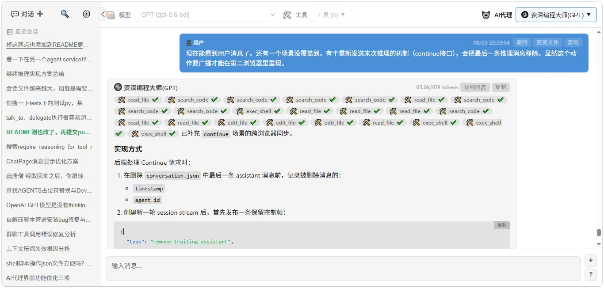

# 💎 玲珑 Linglong Agent Service

极简、零第三方运行时依赖的 Agent Service，基于 Python 标准库构建：可基于项目上下文自举编码 Agent，运行时动态连接大模型、工具、提示词模板与 Subagent，并内置 Web UI 管理控制台、群聊与完整的 HTTP API。

**开源地址：** <https://github.com/mz24cn/agents>

[📚 中文文档](README_zh.md) · [🌐 English](README_en.md) · [License](LICENSE)

---

## 📰 更新动态（News）

### 2026-09-17

- **TUI 对话客户端（`tui.py`）** — 纯 Python 标准库实现的本地终端对话客户端：终端内流式对话、斜杠命令管理、会话管理，零第三方依赖，SSH 登录服务器后 `python tui.py` 即开即聊，用法见 [docs/introduce-tui.md](docs/introduce-tui.md)；其主要用途之一是子端隧道注册，`/tunnel register <url>` 将本机 agent 注册到母端，供远程访问。

### 2026-09-13

- **远程环境管理与远程执行：一个母端，指挥 N 个 Agent 环境** — 母端集中管理子环境：URL 添加、并行状态检查（版本快照/推理状态/在线）、一键推送增量更新（推送模型：子端无需能访问母端，母端可匿名或仅内网）；聊天会话可绑定子环境「远程执行」——推理留在母端，全部工具在子端执行，终端、工作区文件与文件 journal 均可在母端 UI 直接操作；支持直连 HTTP 与 WS 反向隧道两种传输，子端主动拨号母端、穿透 NAT/内网，无公网地址的子端也能被集中管理与远程执行。[阅读全文](docs/introduce-remote-execution.md)

### 2026-08-23

- **多浏览器共享会话实时推理** — 同一会话可在多个浏览器或标签页中同步观看和操作；服务端实时广播并保留当前用户消息、推理内容、thinking、工具调用及结果，新加入的浏览器可重放尚未落盘的实时进度，Continue/retry 等会话变更也会同步到所有浏览器。

- **飞行模式（Flight Mode）** — 支持按会话开启后台持续推理；即使所有浏览器断开连接、关闭页面或切走，推理任务仍会在服务端继续执行并持久化，稍后重新打开即可恢复观看；未开启时，最后一个浏览器离开后会取消无人观察的推理，避免无意消耗模型资源。

### 2026-08-10

- **群聊机制：让多个 AI 真正"聊起来"** — 多个已注册 AI 代理共享同一会话，通过 `@昵称`/`@AgentID`/`@all` 定向唤起与广播，回复中的 `@` 自动驱动多轮接力，让 AI 从"被单点调度的工具"变成"能对等讨论的一群人"。[阅读全文](docs/introduce-group-chat.md)

- **exec_cli：让 Agent "坐进终端"** — 内置 `exec_cli` 工具连接持久化 Shell 终端，让 Agent 无缝操作数据库、容器、SSH 等任意命令行环境；配合自安装脚本可将 Agent Service 自主部署到远程机器。[阅读全文](docs/introduce-exec_cli-tool.md)

- **用 Agent Service 全自动注册网站用户** — 邮箱验证 + 手机短信验证"一镜到底"：真实演示 Agent 控制浏览器完成注册表单填写、邮箱验证、手机号绑定与短信验证的全流程。[阅读全文](docs/introduce-agent-auto-register.md)

- **用 Agent Service 全自动实现视频号扫码登录** — 双机方案 + 摄像头物理拍摄 + OCR 定位，把微信视频号"每日扫码登录"变为全自动。[阅读全文](docs/introduce-wechat-scan-login.md)

---

## 📚 章节索引（README_zh.md）

[特性](README_zh.md#特性) · [架构](README_zh.md#架构) · [快速开始](README_zh.md#快速开始) · [HTTP API 接口](README_zh.md#http-api-接口) · [Web UI 管理控制台](README_zh.md#web-ui-管理控制台) · [功能示例](README_zh.md#功能示例) · [数据持久化](README_zh.md#数据持久化) · [环境要求](README_zh.md#环境要求) · [背景与动机](README_zh.md#背景与动机) · [开源协议](README_zh.md#开源协议)

## 🌐 Chapter Index（README_en.md）

[Features](README_en.md#features) · [Architecture](README_en.md#architecture) · [Quick Start](README_en.md#quick-start) · [HTTP API Reference](README_en.md#http-api-reference) · [Web UI](README_en.md#web-ui) · [Examples](README_en.md#examples) · [Data Persistence](README_en.md#data-persistence) · [Requirements](README_en.md#requirements) · [Background & Motivation](README_en.md#background--motivation) · [License](README_en.md#license)

---

## License

MIT License — see [LICENSE](LICENSE)
