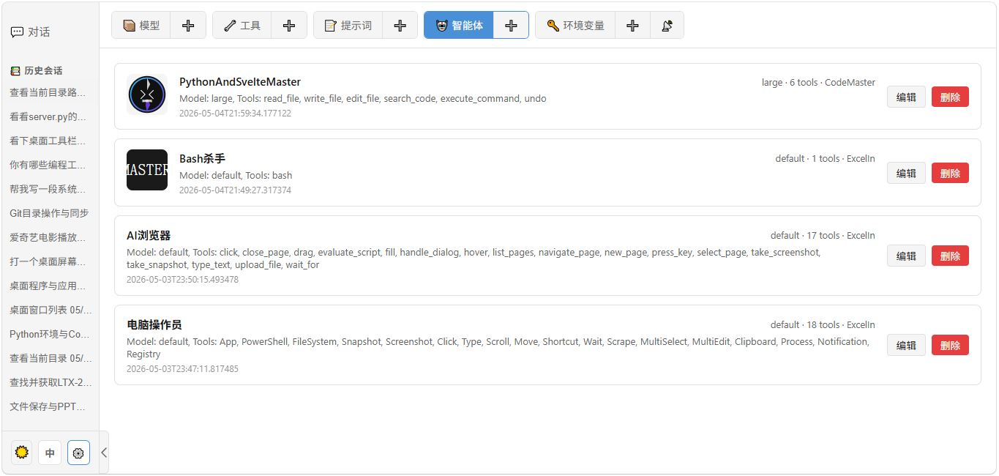
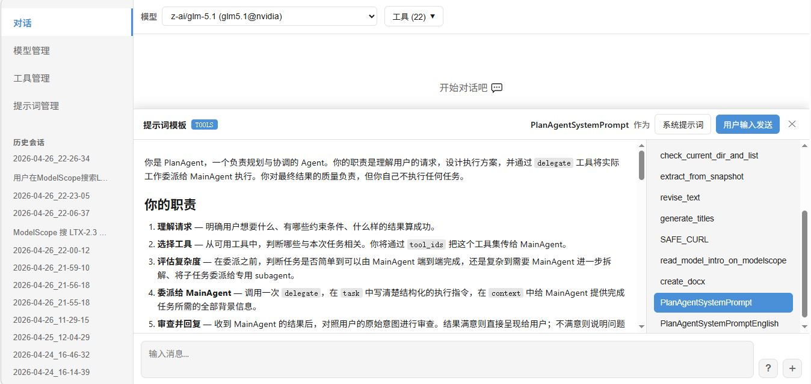
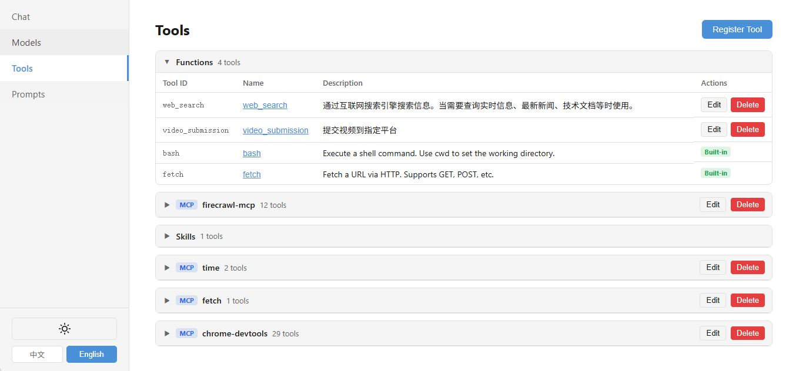

# 💎玲珑 Linglong Agent Service

[English](#english) | [中文](#中文)





---

<a name="english"></a>

## English

A minimal, zero-dependency Agent Service built with the pure Python standard library. It bootstraps coding agents from project context and dynamically connects LLMs, tools, prompt templates, and subagents at runtime — no static agent definitions required.

### Features

- **Zero third-party dependencies** — core runtime uses only Python standard library
- **Self-bootstrapping agents** — bootstrap runnable coding agents from project context, model/tool configuration, prompts, skills, and session state
- **Multi-protocol support** — OpenAI-compatible API, Ollama native `/api/chat`, and Anthropic Messages API
- **Three tool types** — in-process Function tools, MCP (Model Context Protocol) tools, and Skills
- **Direct MCP/function tool invocation** — bypass the LLM and call MCP/function tools directly, 100% reliability; optionally return parsed JSON with `format: "json"`
- **Skill progressive disclosure** — first round exposes only skill summary; full `SKILL.md` is injected only when the model selects the skill
- **Streaming inference** — real-time token streaming with thinking/reasoning content support
- **Prompt template inference** — user messages can reference a named template by ID; `{{placeholder}}` variables are resolved at runtime from the request's `arguments` dict, enabling dynamic prompt adjustment and model/tool-agnostic parameterization without redeploying
- **Multi-agent coordination (talk_to)** — the built-in `talk_to` tool locates registered agents by nickname/Agent ID/labels, sends private messages to one or more targets in parallel, each processed independently with its own model/tools, and aggregates results in order; a simplified form of delegate. Typical executor: a coordinator-type agent such as "资深软件研发经理 (Senior Dev Manager)" — understands requests, identifies capability needs, communicates with specialist agents via talk_to, assigns work, collects results, and owns delivery quality
- **Plan Mode (delegate)** — the built-in `delegate` tool plans a complex task first, splits it into subtasks, and delegates to independent Subagents (each with its own model and toolset, results returned to the caller); supports streaming output, nested delegation, and automatic session persistence. Typical executor: "软件架构师(Plan) (Software Architect / Plan)" — plans based on project context, then delegates execution in parallel
- **Group Chat** — multiple registered AI agents share a single session; `@nickname`/`@AgentID`/`@all` for targeted wake-up and broadcast; an `@` in a member's reply automatically drives the next round (round 2+, deduplicated participants prevent ping-pong, `max_rounds` defaults to 5); each member runs its own model and tools with independent parallel inference; messages carry identity (nickname/agent_id) and persist in the shared session. See [Group Chat mechanism](docs/introduce-group-chat.md)
- **Agent management** — save current model, tools, and system prompt configurations as reusable Agents; quickly switch between saved Agents in the chat interface
- **Web UI management console** — Svelte 5 SPA for managing models, tools, prompt templates, agents, and chat
- **Compact message display** — presents multi-agent collaboration and long tool-chain conversations as compact per-agent reply blocks, pairing each tool call with its execution result in an interactive capsule; arguments and results can be expanded independently by click or hover, with JSON, Python, and Shell syntax highlighting plus Markdown result rendering, preserving full execution details while reducing visual clutter in long sessions
- **Service-level authorization** — optional single-tenant auth system for all `/v1/*` APIs, with Bearer API keys for scripts/SDKs and HttpOnly session cookies for the Web UI; credentials are stored locally as hashes in `~/.agents_runtime/auth_token.json`, and `/v1/setup` export links use short-lived setup tokens
- **HTTP API server** — lightweight REST API built on `http.server`, no FastAPI/uvicorn needed
- **Multimodal** — supports image (base64) and audio inputs for VLM models; when a non-VLM model receives images, they are automatically transcribed to text via the built-in `read_image` tool (register a VLM-capable model whose `model_id` or `labels` include `read-image`)
- **Hardened persistence + continue inference** — each completed tool round is incrementally persisted to `conversation.json` during inference, so an abnormal server restart loses at most the last round; an interrupted session (last turn is a user message / tool call / tool result) can be resumed with one click ("Continue") in the Web UI, or via API by posting `"continue": true` to `/v1/infer/stream` with an empty `messages` array
- **Multi-task concurrent conversations with real-time status tracking** — support multiple simultaneous chat sessions with independent streaming states; real-time session status updates via SSE (streaming, success, error, unread); automatic read status management based on user scroll position; session title broadcasting
- **Real-time shared inference across browsers** — view and interact with the same session from multiple browsers or tabs; the server retains and broadcasts the current user turn, assistant/token and thinking output, tool calls, and tool results, allowing newly attached browsers to replay live progress that has not yet been persisted; inference remains visible when switching sessions or browsers, and Continue/retry removal of the previous assistant response is synchronized to every browser
- **Flight Mode** — enable persistent background inference per session; when enabled, inference continues and is persisted on the server even after every browser disconnects, closes the page, or navigates away, and can be observed again later; without Flight Mode, an unobserved inference is cancelled after the last browser disconnects to avoid unintended model usage
- **Workspace file management** — full-featured workspace file manager with directory tree navigation, file listing (list/grid views), search (AND/OR modes via ripgrep/grep), rename, duplicate, delete, download, and chunked/parallel upload with pause/resume/retry support; workspace file references (`<file>path</file>`) in chat prompts are auto-expanded to inline content or attached images at inference time
- **Self-install setup script** — export the current Agent Service code, built Web UI (`web/dist`), and runtime configuration as a self-extracting installer via `/v1/setup`; install on another machine from Linux/macOS shell with `curl -s http://{host}:7988/v1/setup | sh`, or from Windows PowerShell with `irm http://{host}:7988/v1/setup | iex`.
- **Online incremental updates** — the Web UI can connect to a remote Agent Service to check for and apply updates, independently comparing frontend, backend, and runtime-configuration versions and downloading only the minimal changed delta; configuration updates hot-reload models, tools, MCP servers, prompt templates, and agents, while frontend/config-only updates require no restart and Python backend changes trigger an automatic safe restart; updates are blocked while inference is active to protect in-progress sessions
- **Persistent terminal sessions for exec_cli tool** — the built-in `exec_cli` tool connects to persistent shell terminals that survive across multiple tool calls within a session; this enables seamless interaction with any command-line program including databases, containers, SSH sessions, and development environments. Supports multiple concurrent terminals per session, so you can run long-lived processes in one terminal while executing commands in another. Combined with the self-install script, this allows deploying the Agent Service itself to remote machines via SSH, turning it into a fully autonomous remote assistant that can operate any accessible environment with near-zero overhead.

### Architecture

```
runtime/
├── __init__.py              # Public API exports
├── models.py                # Data models: Message, ModelConfig, ToolConfig, etc.
├── registry.py              # ModelRegistry + ToolRegistry
├── protocols.py             # Protocol adapters: OpenAI / Ollama / Anthropic
├── runtime.py               # Runtime engine: inference + tool call loop + Skill disclosure
├── tools.py                 # Function tool decorator
├── skill_manager.py         # SkillManager: SKILL.md parsing and progressive disclosure
├── mcp_client.py            # MCP Client: pure stdlib stdio/SSE implementation (StreamReader limit raised to 100 MB for large payloads)
├── builtin_tools.py         # Built-in tools: write_file, exec_shell
├── prompt_template_manager.py  # Prompt template CRUD
├── context_manager.py       # Context manager: session management, rolling summary, memory extraction
├── env_manager.py           # Environment variable manager
├── session_manager.py       # Session index manager
├── workspace_manager.py     # Workspace file manager: listing, search, upload, file refs
└── server.py                # HTTP API server

web/                         # Svelte 5 management console SPA
examples/                    # Usage examples
```

### Quick Start

**1. Python API — Function Tool**

```python
import os
from runtime import (
    ModelConfig, ModelRegistry,
    ToolConfig, ToolRegistry,
    Runtime, InferenceRequest, Message,
)

# Register a model (Ollama)
model_registry = ModelRegistry()
model_registry.register(ModelConfig(
    model_id="qwen3-14b",
    api_base="http://localhost:11434",
    model_name="qwen3:14b",
    api_protocol="ollama",
))

# Register a function tool
tool_registry = ToolRegistry()
tool_registry.register(
    ToolConfig(
        tool_id="web_search",
        tool_type="function",
        name="web_search",
        description="Search the internet for information.",
        parameters={
            "type": "object",
            "properties": {
                "query": {"type": "string", "description": "Search query"},
            },
            "required": ["query"],
        },
    ),
    callable_fn=my_search_function,
)

# Run inference
runtime = Runtime(model_registry=model_registry, tool_registry=tool_registry)
result = runtime.infer(InferenceRequest(
    model_id="qwen3-14b",
    tool_ids=["web_search"],
    messages=[Message(role="user", content="What is the latest Python version?")],
))
print(result.messages[-1].content)
```

**2. MCP Tools**

Since `MCPClientManager` is a singleton, any code running in the same process as the server can call a registered MCP tool directly in one line:

```python
from runtime.mcp_client import MCPClientManager
result = MCPClientManager().call_tool("chrome-devtools", "new_page", {"url": "https://example.com"})
```

To use MCP tools with model inference:

```python
from runtime import ModelRegistry, ToolRegistry, Runtime, InferenceRequest
from runtime.mcp_client import MCPClientManager

mcp = MCPClientManager()
mcp.load_config({
    "mcpServers": {
        "time": {"command": "uvx", "args": ["mcp-server-time"]},
        "fetch": {"command": "uvx", "args": ["mcp-server-fetch"]},
    }
})

tool_registry = ToolRegistry()
all_tools = []
for server_name in ["time", "fetch"]:
    tools = mcp.get_tools(server_name)
    for t in tools:
        tool_registry.register(t)
    all_tools.extend(tools)

runtime = Runtime(model_registry=..., tool_registry=tool_registry, mcp_manager=mcp)
result = runtime.infer(InferenceRequest(
    model_id="my-model",
    tool_ids=[t.tool_id for t in all_tools],
    text="What time is it now?",
))
```

**3. Skill with Progressive Disclosure**

```python
from runtime import ModelRegistry, ToolRegistry, Runtime, InferenceRequest, SkillManager

tool_registry = ToolRegistry()
skill_manager = SkillManager(tool_registry)
skill_config = skill_manager.load_skill("/path/to/my_skill")  # directory with SKILL.md

runtime = Runtime(
    model_registry=...,
    tool_registry=tool_registry,
    skill_manager=skill_manager,
)

# Stream with progressive disclosure
for msg in runtime.infer_stream(InferenceRequest(
    model_id="my-model",
    tool_ids=[skill_config.tool_id],
    text="Help me query the latest data",
    max_tool_rounds=20,
)):
    if msg.content:
        print(msg.content, end="", flush=True)
    elif msg.thinking:
        print(f"[thinking] {msg.thinking}", end="", flush=True)
```

**4. Prompt Template Inference**

Prompt templates let you define reusable, parameterized prompts that are resolved at runtime — no redeployment needed when you want to tweak wording or adapt to a different model.

```python
from runtime import Runtime, InferenceRequest, Message
from runtime.prompt_template_manager import PromptTemplateManager

# Create a template with {{placeholder}} variables
pt_manager = PromptTemplateManager()
pt_manager.create(
    name="summarize",
    content="Please summarize the following text in {{language}}:\n\n{{text}}",
)

runtime = Runtime(
    model_registry=...,
    tool_registry=...,
    prompt_template_manager=pt_manager,
)

# Reference the template by name; supply variables via arguments
result = runtime.infer(InferenceRequest(
    model_id="qwen3-14b",
    messages=[Message(
        role="user",
        prompt_template="summarize",
        arguments={"language": "English", "text": "...long article..."},
    )],
))
print(result.messages[-1].content)
```

The template content is fetched and all `{{variable}}` placeholders are substituted before the message is sent to the model. Templates can be created, updated, and deleted at runtime via the HTTP API or Web UI — making prompt iteration fast without touching code.

**5. Plan Mode (Delegate Tool)**

The built-in `delegate` tool enables Plan Mode: the parent agent plans a complex task, splits it into subtasks, and spawns Subagents with different models and toolsets to handle specialized subtasks:

```python
from runtime import Runtime, InferenceRequest, Message

runtime = Runtime(model_registry=..., tool_registry=...)

# The parent agent uses a general-purpose model with the delegate tool
result = runtime.infer(InferenceRequest(
    model_id="qwen3-14b",
    tool_ids=["delegate", "web_search"],  # delegate + other tools
    messages=[Message(
        role="user",
        content="Research the latest AI breakthroughs and write a summary report.",
    )],
))

# The model may call delegate() with:
# - model_id: a specialized model (e.g., a coding model for code generation)
# - tool_names: subset of available tools for the Subagent
# - task: the subtask description
# - context: optional system prompt for the Subagent
```

Key features:
- **Streaming output**: Subagent responses stream back in real-time via SSE
- **Nested delegation**: Subagents can further delegate to deeper-level agents
- **Tool scoping**: Parent agent's tools are automatically listed in a Markdown table and injected into the Subagent's system prompt
- **Session persistence**: Each Subagent session is saved to `~/.agents_runtime/chat_data/{session_id}/sub_{timestamp}/`

**6. Start the HTTP Server**

```bash
python app.py              # from AGENTS_URL; default http://0.0.0.0:7988
python app.py 7988         # custom port (overrides AGENTS_URL)
python app.py 0.0.0.0:9000 # custom host and port (overrides AGENTS_URL)
```

The access address comes from the `AGENTS_URL` environment variable
(e.g. `https://domain:7988/`), parsed into protocol, domain and port
when the server starts:

- a domain of `localhost` binds to `127.0.0.1`; a valid IP literal binds
  to that IP; any other domain name binds to `0.0.0.0`;
- an `https` protocol enables TLS. Certificates live in `DATA_DIR/certs`
  and are loaded per SNI domain as `{domain}.pem` / `{domain}.key`, so one
  server can serve multiple domain certificates. Unmatched SNI names fall
  back to a default certificate (`default.pem` or a generated
  self-signed one) — browsers show a certificate warning, but the site
  stays reachable;
- with no `AGENTS_URL` and no command-line argument, the defaults are
 `http` + `0.0.0.0` + `7988` (listening on all interfaces so the service
  is reachable from other machines right after installation; set
  `AGENTS_URL=http://localhost:7988/` to restrict access to loopback).

`AGENTS_URL` can be changed in the web UI's environment settings (written
to `env.json` and synced into the process environment at startup); the
change takes effect after a restart.

### HTTP API Reference

| Method | Path | Description |
|--------|------|-------------|
| POST | `/v1/infer` | Non-streaming inference |
| POST | `/v1/infer/stream` | Streaming inference (SSE) |
| POST | `/v1/infer/abort` | Abort an active streaming inference by session ID |
| POST | `/v1/auth/login` | Log in and obtain an access credential |
| POST | `/v1/auth/logout` | Log out and invalidate the current access credential |
| GET | `/v1/auth/config` | Query authorization configuration |
| GET | `/v1/setup` | Export the self-extracting setup script (with short-lived setup token) |
| GET | `/v1/models` | List registered models |
| POST | `/v1/models` | Register a model |
| PUT | `/v1/models/{model_id}` | Update a model |
| DELETE | `/v1/models/{model_id}` | Delete a model |
| GET | `/v1/tools` | List registered tools |
| POST | `/v1/tools` | Register a tool |
| PUT | `/v1/tools/{tool_id}` | Update a tool |
| DELETE | `/v1/tools/{tool_id}` | Delete a tool |
| POST | `/v1/tools/call` | Directly call a tool (bypass LLM) |
| POST | `/v1/tools/mcp` | Register MCP servers |
| POST | `/v1/tools/skill` | Register a skill |
| GET | `/v1/mcp-servers` | List registered MCP servers |
| DELETE | `/v1/mcp-servers/{server_name}` | Delete an MCP server |
| POST | `/v1/sessions/{session_id}/generate-title` | Auto-generate session title |
| POST | `/v1/sessions/{session_id}/revoke` | Revoke a session |
| DELETE | `/v1/tools/batch` | Batch delete tools |
| GET | `/v1/prompt-templates` | List prompt templates |
| POST | `/v1/prompt-templates` | Create a prompt template |
| PUT | `/v1/prompt-templates/{id}` | Update a prompt template |
| DELETE | `/v1/prompt-templates/{id}` | Delete a prompt template |
| GET | `/v1/env` | Get environment variables |
| POST | `/v1/env` | Set environment variable |
| POST | `/v1/env/detect` | Auto-detect environment variables |
| DELETE | `/v1/env/{key}` | Delete environment variable |
| GET | `/v1/sessions` | List all sessions |
| GET | `/v1/sessions/events` | SSE endpoint for real-time session status updates |
| GET | `/v1/sessions/search` | Search sessions (full-text search with pagination) |
| GET | `/v1/sessions/{session_id}` | Get session details |
| DELETE | `/v1/sessions/{session_id}` | Delete session |
| POST | `/v1/sessions/{session_id}/read` | Mark session as read |
| GET | `/v1/sessions/{session_id}/log-dir` | Get the absolute path of the session log directory |
| GET | `/v1/sessions/{session_id}/file-journals` | List the session's file journals (turn keys) |
| GET | `/v1/sessions/{session_id}/file-journals/{turn_key}` | Get the file journal diff for a specific turn |
| POST | `/v1/sessions/{session_id}/regenerate-summary` | Regenerate the session summary and memory |
| GET | `/v1/agents` | List all agents |
| GET | `/v1/agents/{agent_id}` | Get a single agent |
| POST | `/v1/agents` | Create an agent |
| PUT | `/v1/agents/{agent_id}` | Update an agent |
| DELETE | `/v1/agents/{agent_id}` | Delete an agent |
| GET | `/v1/terminals` | List active terminal sessions |
| DELETE | `/v1/terminals/{terminal_id}` | Destroy a terminal session |
| GET | `/v1/workspace/list` | List files in a workspace directory (paginated) |
| GET | `/v1/workspace/children` | List child directories of any path (no workspace restriction) |
| GET | `/v1/workspace/search` | Search files in workspace (AND/OR modes) |
| GET | `/v1/workspace/content` | Get file content for preview |
| GET | `/v1/workspace/download` | Download a file |
| GET | `/v1/workspace/thumbnail` | Get image thumbnail |
| POST | `/v1/workspace/rename` | Rename a file or directory |
| POST | `/v1/workspace/mkdir` | Create a directory |
| POST | `/v1/workspace/duplicate` | Duplicate a file |
| POST | `/v1/workspace/move` | Move files/directories |
| POST | `/v1/workspace/copy` | Copy files/directories |
| DELETE | `/v1/workspace/delete` | Delete a file or directory |
| POST | `/v1/workspace/upload/init` | Initialize a chunked file upload |
| PUT | `/v1/workspace/upload/{upload_id}/chunk/{chunk_id}` | Upload a file chunk |
| POST | `/v1/workspace/upload/{upload_id}/complete` | Complete a chunked upload |
| DELETE | `/v1/workspace/upload/{upload_id}` | Cancel an upload |

> **Note:** A WebSocket terminal `WS /ws` (without the `/v1` prefix, not listed above) is also available for real-time terminal sessions in the browser.

**Streaming inference request:**

```json
{
  "model_id": "qwen3-14b",
  "tool_ids": ["web_search"],
  "messages": [
    {"role": "system", "content": "You are a helpful assistant."},
    {"role": "user", "content": "Search for the latest AI news."}
  ],
  "stream": true,
  "max_tool_rounds": 10,
  "session_id": "new"
}
```

> **Note:** The `session_id` field is optional. Use `"new"` to create a new session, an existing session ID to resume a conversation, or omit it for stateless inference.

### Web UI



The management console is a Svelte 5 SPA located in `web/`. Build and serve it:

```bash
cd web
npm install
npm run build
```

The built files in `web/dist/` are automatically served by the HTTP server at the root path.

Features:
- Chat with model selection, tool selection, prompt template support, and agent selection
- Multi-task concurrent conversations — each session maintains independent streaming state; switching sessions doesn't interrupt active streams
- Real-time session status indicators in sidebar (streaming, success-unread, error-unread) via SSE
- Automatic read status management — marks session as read when user scrolls to bottom
- Model management (CRUD) — copy an existing model config to quickly create a new one
- Tool management (CRUD)
- Prompt template management with `{{placeholder}}` variable support
- Agent management — save current configuration as a reusable agent; switch agents in the chat interface
- Authorization settings — configure the Web login password, session cookie lifetime, API Bearer Key, and short-lived `/v1/setup` export commands from the browser
- Markdown rendering with syntax highlighting
- Expandable long JSON string previews that auto-fit the available code block width
- Workspace file manager — directory tree navigation, list/grid views, file search, rename/duplicate/delete, chunked upload with progress tracking, and clipboard paste upload
- Rich text chat input with workspace file reference chips (`<file>path</file>`)
- Multimodal: image upload and microphone recording
- Dark/light theme, responsive layout
- Resizable sidebar with collapse/expand toggle; width persisted to localStorage

### Examples

| File | Description |
|------|-------------|
| `accessories/web_search_function.py` | Register a SearXNG search as a Function Tool; the LLM automatically calls it to answer queries |
| `examples/example_mcp_ollama.py` | Connect Ollama (qwen3:14b) with MCP `time` and `fetch` servers; supports `--stream` flag |
| `examples/example_mcp_openai.py` | Same as above but using the OpenAI-compatible protocol; easily switch to OpenAI, vLLM, LiteLLM, etc. |
| `examples/example_skill.py` | Load a Skill from a directory and run streaming inference with progressive SKILL.md disclosure |
| `examples/example_vlm_tool_call.py` | VLM reads an image, understands the instruction in it, and calls built-in `write_file`/`exec_shell` tools to execute |
| `examples/example_browser_use.py` | Client/server split: server registers chrome-devtools MCP; client calls `/v1/tools/call` to open a page directly, then `/v1/infer/stream` to let the LLM inspect and interact with the browser |
| `examples/example_stream_as_infer.py` | Use `/v1/infer/stream` (SSE) to receive streaming tokens and reassemble them into the same JSON structure as `/v1/infer` — avoids idle-timeout disconnections on long-running inference |
| `examples/example_multi_agents.py` | Plan Mode: Software Architect (Plan) delegates subtasks to MainAgent via the `delegate` tool. Demonstrates prompt templates, MCP tools, and hierarchical task delegation with automatic TOOLS markdown generation |

### Data Persistence

All configuration is persisted to `~/.agents_runtime/`:

```
~/.agents_runtime/
├── models.json
├── tools.json
├── mcp_servers.json
├── prompt_templates.json
├── env.json
├── agents/                  # Agent data directory
│   └── {agent_id}.json      # Individual agent configuration files
└── chat_data/              # Session data directory
    └── {session_id}/
        ├── conversation.json
        ├── summary.md
        └── memory.md
```

`env.json` is a flat key-value map of environment variables loaded at server startup, useful for injecting API keys and other secrets without modifying the system environment:

```json
{
  "OPENAI_API_KEY": "sk-...",
  "SOME_SERVICE_TOKEN": "abc123"
}
```

### Requirements

- Python 3.10+
- No third-party Python packages required for the core runtime
- For the web UI: Node.js 18+ and npm

### Background & Motivation

This project was born out of frustrations encountered while using [Qwen-Agent](https://github.com/QwenLM/Qwen-Agent). Several pain points drove the decision to build a new Agent Service from scratch:

- MCP tools are registered per-agent, so different agents each spin up their own local MCP process instances — unnecessary overhead since most MCP servers can be shared as stateless services.
- The combinatorial explosion of models × tools makes static pre-definitions impractical.
- Function tools cannot be dynamically defined and loaded at runtime.
- MCP/function tools cannot be called directly — every invocation must go through the LLM, making deterministic automation unreliable.
- No support for Skills.
- Hard-coded OpenAI protocol causes abnormal inference behavior when connecting to local Ollama models for VLM tasks.
- The Web UI and a clean HTTP server API cannot run in the same process simultaneously.
- Models, tools, and prompt templates need to be added, updated, and removed at runtime — especially prompt templates, which require frequent iteration. The author added CRUD support to the official Qwen-Agent GUI ([fork here](https://github.com/mz24cn/Qwen-Agent)), but the Gradio-based UI is sluggish and the experience is poor.

These issues made building a dedicated Agent Service worthwhile. Leveraging the power of modern AI-assisted development, this project was built from scratch to address all of the above. It intentionally avoids introducing third-party dependencies so it can be embedded into any existing project — usable as either an SDK or a standalone HTTP service.

The project is under active development. Next steps include enhancing the multi-agent collaboration framework with more orchestration patterns and the closely related topic of secure user data management.

### License

MIT License — see [LICENSE](LICENSE)

---

<a name="中文"></a>
