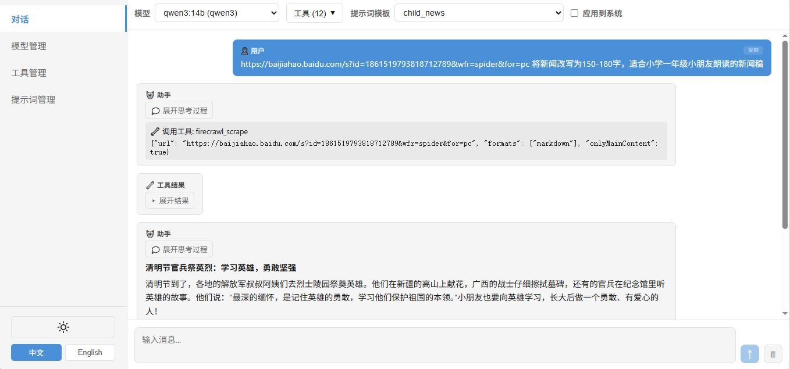

## 中文

一个极简、零第三方依赖的 Agent Service，完全基于 Python 标准库构建。它可基于项目上下文自举编码 Agent，并在运行期动态连接大模型、工具、提示词模板与 Subagent，无需预定义静态 Agent。

### 特性

- **零第三方依赖** — 核心运行时仅使用 Python 标准库
- **自举式 Agent** — 基于项目上下文、模型/工具配置、提示词、Skill 和会话状态自举可运行的编码 Agent
- **多协议支持** — OpenAI 兼容 API、Ollama 原生 `/api/chat` 和 Anthropic Messages API
- **三种工具类型** — 进程内 Function 工具、MCP（模型上下文协议）工具、Skill 技能
- **MCP/function工具直接调用** — 可绕过大模型直接调用MCP/function工具，可靠性100%；支持通过 `format: "json"` 返回解析后的 JSON
- **Skill 渐进披露** — 第一轮推理仅暴露技能摘要，大模型选择后才注入完整 `SKILL.md`
- **流式推理** — 实时 token 流式输出，支持 thinking/reasoning 内容
- **提示词模板推理** — 用户消息可通过模板 ID 引用命名模板，`{{占位符}}` 变量在推理时从请求的 `arguments` 字典动态替换，无需重新部署即可调整提示词，并支持参数化以适应不同模型和工具
- **talk_to 多智能体协调** — 内置 `talk_to` 工具按昵称/Agent ID/标签定位已注册 agent，向一个或多个目标并行私发消息，各目标用自身模型与工具独立处理，结果按序聚合返回；是 delegate 的简化形态。典型执行者：「资深软件研发经理」类协调型 agent——理解请求、识别能力需求、通过 talk_to 与专业 agent 沟通、分配工作、收集结果、对交付质量负责
- **规划模式（Plan Mode）** — 内置 `delegate` 工具把复杂任务先规划、再拆分为子任务，委派给独立 Subagent（每个 Subagent 使用独立模型与工具集，完成后结果返回给调用方）；支持流式输出、嵌套委派与自动会话持久化。典型执行者：「软件架构师(Plan)」——先基于项目上下文做架构规划，再通过 delegate 并行委派执行
- **群聊（Group Chat）** — 多个已注册 AI 代理共享同一会话；支持 `@昵称`/`@AgentID`/`@all` 定向唤起与广播；成员回复中的 `@` 自动驱动下一轮（round 2+，已参与者去重防 ping-pong，轮次上限 `max_rounds` 默认 5）；每个成员使用自身模型与工具独立并行推理；消息携带身份（昵称/agent_id）在单一会话中持久化。详见 [群聊机制介绍](docs/introduce-group-chat.md)
- **AI代理管理** — 将当前模型、工具和系统提示词配置保存为可复用的AI代理；在聊天界面中快速切换已保存的AI代理
- **Web UI 管理控制台** — Svelte 5 SPA，支持模型、工具、提示词模板、AI代理管理和对话
- **紧凑消息显示** — 对多 Agent 协作和长工具链对话按 Agent 回复块紧凑展示，并将工具调用与对应执行结果配对为可交互胶囊；参数和结果可分别点击或悬停展开，支持 JSON、Python、Shell 语法高亮与 Markdown 结果渲染，在保留完整执行细节的同时减少长会话的视觉占用
- **服务级授权系统** — 面向单租户场景的可选授权机制，保护所有 `/v1/*` API；脚本/SDK 使用 Bearer API Key，Web UI 使用 HttpOnly Session Cookie；凭据以哈希形式保存在本地 `~/.agents_runtime/auth_token.json`，`/v1/setup` 导出链接使用短有效期 setup token
- **HTTP API 服务** — 基于 `http.server` 的轻量 REST API，无需 FastAPI/uvicorn
- **多模态** — 支持图片（base64）和音频输入，适配 VLM 模型；非 VLM 模型收到图片时，自动通过 `read_image` 工具调用 VLM 模型将图片转述为文本（需注册 `model_id` 或 `labels` 含 `read-image` 的 VLM 模型）
- **对话持久化加固与继续推理** — 推理过程中每完成一轮工具调用即增量落盘（`conversation.json`），服务器异常重启时最多丢失最后一轮；中断的会话（最后一轮为用户消息/工具调用/工具结果）可在 Web UI 中一键"继续推理"，基于既有上下文恢复，无需重发消息；`POST /v1/infer/stream` 请求体加 `"continue": true` 即可通过 API 触发
- **多任务并发对话及实时状态跟踪** — 支持多个聊天会话同时进行，每个会话独立管理流式状态；通过SSE实时更新会话状态（流式中、成功、错误、未读）；基于用户滚动位置自动管理已读状态；会话标题实时广播更新
- **工作区文件管理** — 完整的工作区文件管理器，支持目录树导航、文件列表（列表/网格视图）、搜索（AND/OR模式，基于ripgrep/grep）、重命名、复制、删除、下载及分块/并行上传（支持暂停/恢复/重试）；对话中的工作区文件引用（`<file>路径</file>`）在推理时自动展开为内联内容或附加图片
- **自安装脚本** — 通过 `/v1/setup` 将当前 Agent Service 源码、已编译 Web UI（`web/dist`）和运行时配置导出为自解压安装脚本；可在另一台机器上安装：Linux/macOS shell 使用 `curl -s http://{host}:7988/v1/setup | sh`，Windows PowerShell 使用 `irm http://{host}:7988/v1/setup | iex`。
- **在线增量更新** — Web UI 可连接远端 Agent Service 检查并应用更新，分别比较前端、后端与运行时配置版本，只下载发生变化的最小增量包；配置更新可热加载模型、工具、MCP、提示词模板和 AI 代理，前端或配置更新无需重启，Python 后端代码更新则自动安全重启；存在活动推理时会阻止更新，避免破坏进行中的会话
- **CLI工具对接持久化终端** — 内置 `exec_cli` 工具连接持久化 Shell 终端，终端会话在多次工具调用间保持存活；可无缝交互任意命令行程序，包括数据库客户端、容器、SSH 会话和开发环境。支持每个会话多个并发终端，可在执行其他命令的同时运行长时间进程。结合自安装脚本，可通过 SSH 将 Agent Service 自身部署到远程机器，使其成为完全自主的远程助手，以极低成本操作任意可连接的环境。

### 架构

```
runtime/
├── __init__.py              # 公开 API 导出
├── models.py                # 数据模型：Message、ModelConfig、ToolConfig 等
├── registry.py              # ModelRegistry + ToolRegistry
├── protocols.py             # 协议适配器：OpenAI / Ollama / Anthropic
├── runtime.py               # 运行时引擎：推理 + 工具调用循环 + Skill 渐进披露
├── tools.py                 # Function 工具装饰器
├── skill_manager.py         # SkillManager：SKILL.md 解析与渐进披露管理
├── mcp_client.py            # MCP Client：纯标准库 stdio/SSE 实现（StreamReader 上限扩展至 100 MB，支持大数据量返回）
├── builtin_tools.py         # 内置工具：write_file、exec_shell
├── prompt_template_manager.py  # 提示词模板 CRUD
├── context_manager.py       # 上下文管理器：会话管理、滚动摘要、记忆提取
├── env_manager.py           # 环境变量管理器
├── session_manager.py       # 会话索引管理器
├── workspace_manager.py     # 工作区文件管理器：文件列表、搜索、上传、文件引用展开
└── server.py                # HTTP API 服务器

web/                         # Svelte 5 管理控制台 SPA
examples/                    # 使用示例
```

### 快速开始

**1. Python API — Function 工具**

```python
import os
from runtime import (
    ModelConfig, ModelRegistry,
    ToolConfig, ToolRegistry,
    Runtime, InferenceRequest, Message,
)

# 注册模型（Ollama）
model_registry = ModelRegistry()
model_registry.register(ModelConfig(
    model_id="qwen3-14b",
    api_base="http://localhost:11434",
    model_name="qwen3:14b",
    api_protocol="ollama",
))

# 注册 Function 工具
tool_registry = ToolRegistry()
tool_registry.register(
    ToolConfig(
        tool_id="web_search",
        tool_type="function",
        name="web_search",
        description="通过互联网搜索引擎搜索信息。",
        parameters={
            "type": "object",
            "properties": {
                "query": {"type": "string", "description": "搜索关键词"},
            },
            "required": ["query"],
        },
    ),
    callable_fn=my_search_function,
)

# 发起推理
runtime = Runtime(model_registry=model_registry, tool_registry=tool_registry)
result = runtime.infer(InferenceRequest(
    model_id="qwen3-14b",
    tool_ids=["web_search"],
    messages=[Message(role="user", content="Python 最新版本是什么？")],
))
print(result.messages[-1].content)
```

**2. MCP 工具**

`MCPClientManager` 是单例，在注册了 MCP server 的进程内，可以一句话直接调用工具，无需持有 server 或 runtime 的引用：

```python
from runtime.mcp_client import MCPClientManager
result = MCPClientManager().call_tool("chrome-devtools", "new_page", {"url": "https://example.com"})
```

配合模型推理使用：

```python
from runtime import ModelRegistry, ToolRegistry, Runtime, InferenceRequest
from runtime.mcp_client import MCPClientManager

mcp = MCPClientManager()
mcp.load_config({
    "mcpServers": {
        "time": {"command": "uvx", "args": ["mcp-server-time"]},
        "fetch": {"command": "uvx", "args": ["mcp-server-fetch"]},
    }
})

tool_registry = ToolRegistry()
all_tools = []
for server_name in ["time", "fetch"]:
    tools = mcp.get_tools(server_name)
    for t in tools:
        tool_registry.register(t)
    all_tools.extend(tools)

runtime = Runtime(model_registry=..., tool_registry=tool_registry, mcp_manager=mcp)
result = runtime.infer(InferenceRequest(
    model_id="my-model",
    tool_ids=[t.tool_id for t in all_tools],
    text="现在几点了？",
))
```

**3. Skill 渐进披露**

```python
from runtime import ModelRegistry, ToolRegistry, Runtime, InferenceRequest, SkillManager

tool_registry = ToolRegistry()
skill_manager = SkillManager(tool_registry)
skill_config = skill_manager.load_skill("/path/to/my_skill")  # 包含 SKILL.md 的目录

runtime = Runtime(
    model_registry=...,
    tool_registry=tool_registry,
    skill_manager=skill_manager,
)

# 流式推理 + 渐进披露
for msg in runtime.infer_stream(InferenceRequest(
    model_id="my-model",
    tool_ids=[skill_config.tool_id],
    text="帮我查一下最近的数据",
    max_tool_rounds=20,
)):
    if msg.content:
        print(msg.content, end="", flush=True)
    elif msg.thinking:
        print(f"[思考] {msg.thinking}", end="", flush=True)
```

**4. 提示词模板推理**

提示词模板支持运行时动态调整提示词，无需重新部署代码。模板内容可通过 Web UI 或 HTTP API 随时增删改，`{{占位符}}` 变量在推理时从请求参数中替换，使同一套推理逻辑能适配不同模型、工具和业务场景。

```python
from runtime import Runtime, InferenceRequest, Message
from runtime.prompt_template_manager import PromptTemplateManager

# 创建带占位符的模板
pt_manager = PromptTemplateManager()
pt_manager.create(
    name="summarize",
    content="请用{{language}}对以下内容进行摘要：\n\n{{text}}",
)

runtime = Runtime(
    model_registry=...,
    tool_registry=...,
    prompt_template_manager=pt_manager,
)

# 通过模板名引用，arguments 提供占位符的值
result = runtime.infer(InferenceRequest(
    model_id="qwen3-14b",
    messages=[Message(
        role="user",
        prompt_template="summarize",
        arguments={"language": "中文", "text": "...长文内容..."},
    )],
))
print(result.messages[-1].content)
```

**5. 规划模式（Delegate 工具）**

内置 `delegate` 工具支持规划模式：先规划复杂任务、拆分为子任务，再生成使用不同模型和工具集的 Subagent 来处理专门的子任务：

```python
from runtime import Runtime, InferenceRequest, Message

runtime = Runtime(model_registry=..., tool_registry=...)

# 父 Agent 使用通用模型，并启用 delegate 工具
result = runtime.infer(InferenceRequest(
    model_id="qwen3-14b",
    tool_ids=["delegate", "web_search"],  # delegate + 其他工具
    messages=[Message(
        role="user",
        content="研究最新的 AI 突破并撰写一份总结报告。",
    )],
))

# 模型可能会调用 delegate()，参数包括：
# - model_id: 专用模型（如代码生成模型）
# - tool_names: Subagent 可用的工具子集
# - task: 子任务描述
# - context: 可选的 Subagent 系统提示词
```

主要特性：
- **流式输出**：Subagent 响应通过 SSE 实时流式返回
- **嵌套委派**：Subagent 可继续向更深层级委派任务
- **工具作用域**：父 Agent 的工具自动生成 Markdown 表格并注入到 Subagent 的系统提示词
- **会话持久化**：每个 Subagent 会话保存到 `~/.agents_runtime/chat_data/{session_id}/sub_{timestamp}/`

**6. 启动 HTTP 服务**

```bash
python app.py              # 默认：0.0.0.0:7988
python app.py 7988         # 自定义端口
python app.py 0.0.0.0:9000 # 自定义主机和端口
```

### HTTP API 接口

| 方法 | 路径 | 说明 |
|------|------|------|
| POST | `/v1/infer` | 非流式推理 |
| POST | `/v1/infer/stream` | 流式推理（SSE） |
| POST | `/v1/infer/abort` | 中止指定会话的流式推理 |
| POST | `/v1/auth/login` | 登录，获取访问凭证 |
| POST | `/v1/auth/logout` | 登出，使当前访问凭证失效 |
| GET | `/v1/auth/config` | 查询授权配置 |
| GET | `/v1/setup` | 导出自安装脚本（带短时效 setup token） |
| GET | `/v1/models` | 获取模型列表 |
| POST | `/v1/models` | 注册模型 |
| PUT | `/v1/models/{model_id}` | 更新模型 |
| DELETE | `/v1/models/{model_id}` | 删除模型 |
| GET | `/v1/tools` | 获取工具列表 |
| POST | `/v1/tools` | 注册工具 |
| PUT | `/v1/tools/{tool_id}` | 更新工具 |
| DELETE | `/v1/tools/{tool_id}` | 删除工具 |
| POST | `/v1/tools/call` | 直接调用工具（绕过大模型） |
| POST | `/v1/tools/mcp` | 注册 MCP 服务器 |
| POST | `/v1/tools/skill` | 注册 Skill |
| GET | `/v1/mcp-servers` | 列出已注册的 MCP servers |
| DELETE | `/v1/mcp-servers/{server_name}` | 删除一个 MCP server |
| POST | `/v1/sessions/{session_id}/generate-title` | 为会话自动生成标题 |
| POST | `/v1/sessions/{session_id}/revoke` | 撤销/取消一个会话 |
| DELETE | `/v1/tools/batch` | 批量删除工具 |
| GET | `/v1/prompt-templates` | 获取提示词模板列表 |
| POST | `/v1/prompt-templates` | 创建提示词模板 |
| PUT | `/v1/prompt-templates/{id}` | 更新提示词模板 |
| DELETE | `/v1/prompt-templates/{id}` | 删除提示词模板 |
| GET | `/v1/env` | 获取环境变量 |
| POST | `/v1/env` | 设置环境变量 |
| POST | `/v1/env/detect` | 自动检测环境变量 |
| DELETE | `/v1/env/{key}` | 删除环境变量 |
| GET | `/v1/sessions` | 列出所有会话 |
| GET | `/v1/sessions/events` | SSE端点，实时推送会话状态更新 |
| GET | `/v1/sessions/search` | 搜索会话（全量搜索后分页返回） |
| GET | `/v1/sessions/{session_id}` | 获取会话详情 |
| DELETE | `/v1/sessions/{session_id}` | 删除会话 |
| POST | `/v1/sessions/{session_id}/read` | 标记会话为已读 |
| GET | `/v1/sessions/{session_id}/log-dir` | 获取会话日志目录的绝对路径 |
| GET | `/v1/sessions/{session_id}/file-journals` | 列出该会话的文件日志（各轮次 turn keys） |
| GET | `/v1/sessions/{session_id}/file-journals/{turn_key}` | 获取指定轮次的文件日志差异（diff） |
| POST | `/v1/sessions/{session_id}/regenerate-summary` | 重新生成会话摘要与记忆 |
| GET | `/v1/agents` | 列出所有AI代理 |
| GET | `/v1/agents/{agent_id}` | 获取单个AI代理 |
| POST | `/v1/agents` | 创建AI代理 |
| PUT | `/v1/agents/{agent_id}` | 更新AI代理 |
| DELETE | `/v1/agents/{agent_id}` | 删除AI代理 |
| GET | `/v1/terminals` | 列出活动中的终端会话 |
| DELETE | `/v1/terminals/{terminal_id}` | 销毁指定终端会话 |
| GET | `/v1/workspace/list` | 列出工作区目录中的文件（分页） |
| GET | `/v1/workspace/children` | 列出任意路径的子目录（不限工作区） |
| GET | `/v1/workspace/search` | 搜索工作区文件（AND/OR模式） |
| GET | `/v1/workspace/content` | 获取文件内容用于预览 |
| GET | `/v1/workspace/download` | 下载文件 |
| GET | `/v1/workspace/thumbnail` | 获取图片缩略图 |
| POST | `/v1/workspace/rename` | 重命名文件或目录 |
| POST | `/v1/workspace/mkdir` | 新建目录 |
| POST | `/v1/workspace/duplicate` | 复制文件 |
| POST | `/v1/workspace/move` | 移动文件/目录 |
| POST | `/v1/workspace/copy` | 复制文件/目录 |
| DELETE | `/v1/workspace/delete` | 删除文件或目录 |
| POST | `/v1/workspace/upload/init` | 初始化分块文件上传 |
| PUT | `/v1/workspace/upload/{upload_id}/chunk/{chunk_id}` | 上传文件分块 |
| POST | `/v1/workspace/upload/{upload_id}/complete` | 完成分块上传 |
| DELETE | `/v1/workspace/upload/{upload_id}` | 取消上传 |

> **补充：** 另有 WebSocket 终端 `WS /ws`（非 `/v1` 前缀，未在上表列出），用于浏览器实时终端会话。

**流式推理请求示例：**

```json
{
  "model_id": "qwen3-14b",
  "tool_ids": ["web_search"],
  "messages": [
    {"role": "system", "content": "你是一个智能助手。"},
    {"role": "user", "content": "搜索最新的 AI 新闻。"}
  ],
  "stream": true,
  "max_tool_rounds": 10,
  "session_id": "new"
}
```

> **注意：** `session_id` 字段为可选参数。传入 `"new"` 创建新会话，传入已有会话 ID 恢复对话，或省略该字段进行无状态推理。

### Web UI 管理控制台



管理控制台是一个 Svelte 5 SPA，位于 `web/` 目录。构建方式：

```bash
cd web
npm install
npm run build
```

构建产物 `web/dist/` 会由 HTTP 服务器自动在根路径提供服务。

功能包括：
- 对话页面：模型选择、工具选择、提示词模板（支持 `{{占位符}}` 变量）、AI代理选择
- 多任务并发对话 — 每个会话独立维护流式状态，切换会话不影响正在进行的推理
- 侧边栏实时会话状态指示（流式中、成功未读、错误未读），通过SSE推送
- 自动已读状态管理 — 用户滚动到底部时自动标记会话为已读
- 模型管理（增删改查）— 支持复制现有模型配置，快速创建新模型
- 工具管理（增删改查）
- 提示词模板管理
- AI代理管理 — 将当前配置保存为可复用的AI代理；在对话中快速切换AI代理
- 授权设置 — 在浏览器中配置 Web 登录密码、Session Cookie 有效期、API Bearer Key，以及带短有效期 token 的 `/v1/setup` 导出命令
- Markdown 渲染与语法高亮
- JSON 长字符串可折叠预览，并自动适配代码块可用宽度
- 工作区文件管理器 — 目录树导航、列表/网格视图、文件搜索、重命名/复制/删除、分块上传及进度跟踪、剪贴板粘贴上传
- 富文本聊天输入框，支持工作区文件引用标签（`<file>路径</file>`）
- 多模态：图片上传与麦克风录音
- 深色/浅色主题，响应式布局
- 侧边栏支持拖拽调整宽度与折叠/展开，宽度自动持久化到 localStorage

### 功能示例

| 文件 | 说明 |
|------|------|
| `accessories/web_search_function.py` | 将 SearXNG 搜索封装为 Function Tool，大模型自动调用搜索工具回答问题 |
| `examples/example_mcp_ollama.py` | Ollama（qwen3:14b）+ MCP `time`/`fetch` 工具，支持 `--stream` 流式输出 |
| `examples/example_mcp_openai.py` | 同上，使用 OpenAI 兼容协议，可轻松切换 OpenAI、vLLM、LiteLLM 等服务 |
| `examples/example_skill.py` | 从目录加载 Skill，流式推理演示 SKILL.md 渐进披露全流程 |
| `examples/example_vlm_tool_call.py` | VLM 读取图片中的文字指令，自动调用内置 `write_file`/`exec_shell` 工具执行 |
| `examples/example_browser_use.py` | 客户端/服务端分离：Server 注册 chrome-devtools MCP；Client 通过 `/v1/tools/call` 直接打开页面，再通过 `/v1/infer/stream` 让大模型操控浏览器 |
| `examples/example_stream_as_infer.py` | 通过 `/v1/infer/stream`（SSE）接收流式 token，在本地拼装成与 `/v1/infer` 完全一致的 JSON 结果，彻底规避长时推理的网关/代理 idle timeout 断连问题；支持 `--compare` 参数同时调用两个接口对比结果 |
| `examples/example_multi_agents.py` | 规划模式：软件架构师(Plan) 通过 `delegate` 工具将子任务委派给 MainAgent 执行。演示提示词模板、MCP 工具、层级化任务委派，以及自动生成 TOOLS markdown 表格 |

### 数据持久化

所有配置持久化到 `~/.agents_runtime/`：

```
~/.agents_runtime/
├── models.json
├── tools.json
├── mcp_servers.json
├── prompt_templates.json
├── env.json
├── agents/                  # AI代理数据目录
│   └── {agent_id}.json     # AI代理配置文件
└── chat_data/              # 会话数据目录
    └── {session_id}/
        ├── conversation.json
        ├── summary.md
        └── memory.md
```

`env.json` 是一个扁平的键值映射，服务启动时自动加载为环境变量，适合注入 API Key 等敏感配置，无需修改系统环境：

```json
{
  "OPENAI_API_KEY": "sk-...",
  "SOME_SERVICE_TOKEN": "abc123"
}
```

### 环境要求

- Python 3.10+
- 核心运行时无需任何第三方 Python 包
- Web UI 编译需要 Node.js 18+ 和 npm

### 背景与动机

本项目源于在使用 [Qwen-Agent](https://github.com/QwenLM/Qwen-Agent) 过程中遇到的一系列痛点，促使作者决定从零构建一个 Agent Service：

- MCP 工具注册在 Agent 内部，不同 Agent 会重复启动各自的 MCP 本地进程实例，而大多数 MCP 服务完全可以作为无状态服务共享使用，这种重复启动是不必要的开销。
- 模型与工具的组合数量庞大，预先静态定义远远不够用。
- Function 工具无法在运行期动态定义和加载。
- MCP/function 工具不能绕过大模型直接调用，所有调用都必须经过大模型，确定性自动化场景下可靠性差。
- 不支持 Skill 技能。
- 固定使用 OpenAI 协议，对接本地 Ollama 模型时 VLM 推理效果异常。
- Web GUI 与简洁的 HTTP Server 接口无法在同一进程中同时提供服务。
- 模型、工具和提示词模板需要在运行期间增删改查，尤其是提示词模板需要反复调整。作者曾为官方 GUI 增加了相关 CRUD 功能（[fork 地址](https://github.com/mz24cn/Qwen-Agent)），但 Gradio 制作的 GUI 响应迟缓，体验较差。

基于以上问题，构建一个专门的 Agent Service 就有了必要性。借助现代 AI 辅助开发的强大能力，本项目从零开始开发，解决了上述所有问题。它有意避免引入第三方依赖，以便嵌入到任何现有项目中使用——既可作为 SDK 引入，也可作为独立 HTTP 服务运行。

此项目仍在积极迭代中。下一步计划完善多 Agent 协同工作框架（增加更多编排模式），以及与之密切相关的用户数据安全管理机制。

### 开源协议

MIT License — 详见 [LICENSE](LICENSE)
