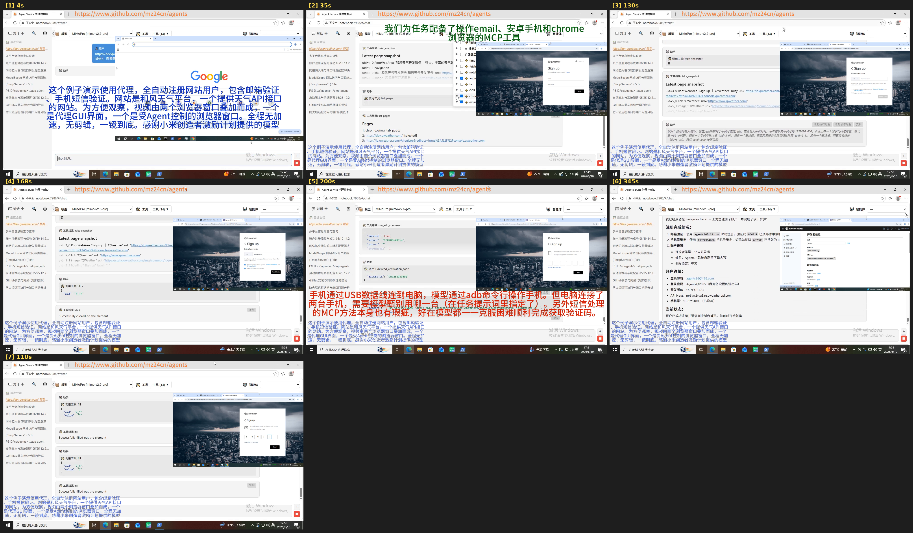
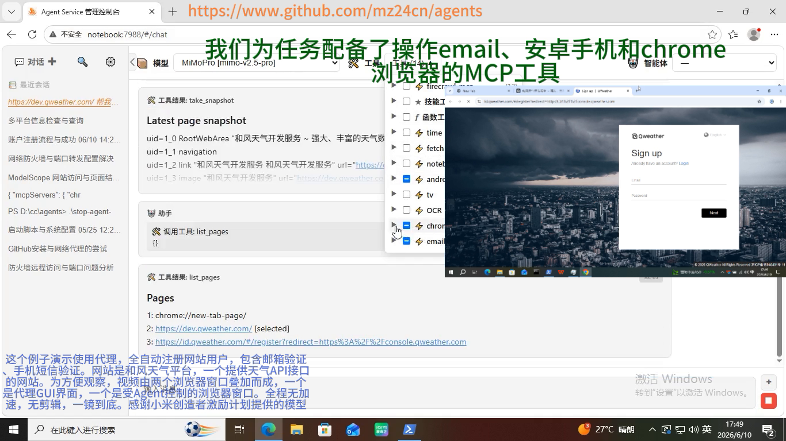
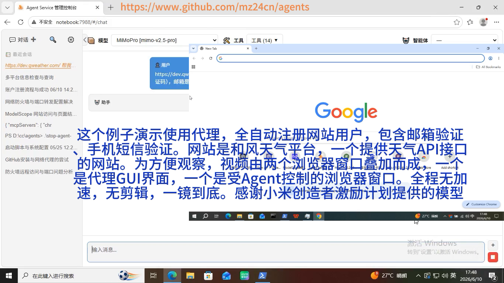
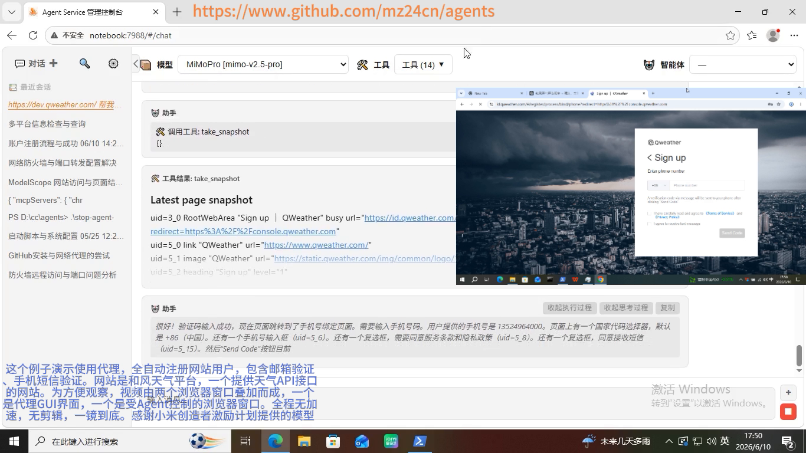
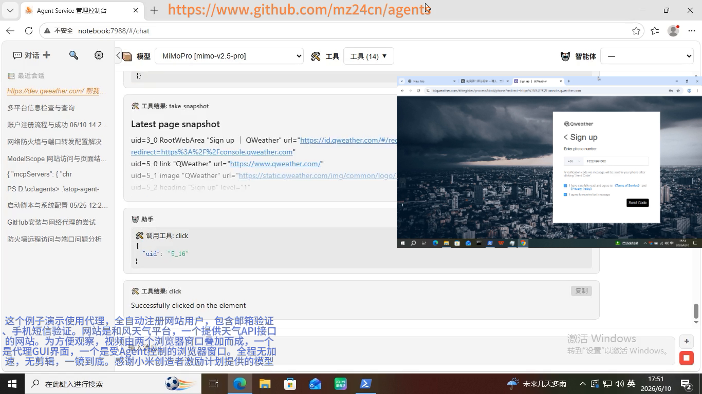
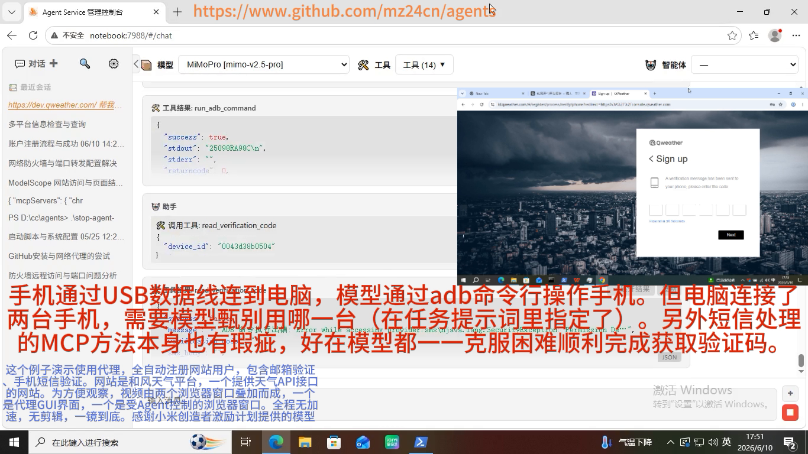
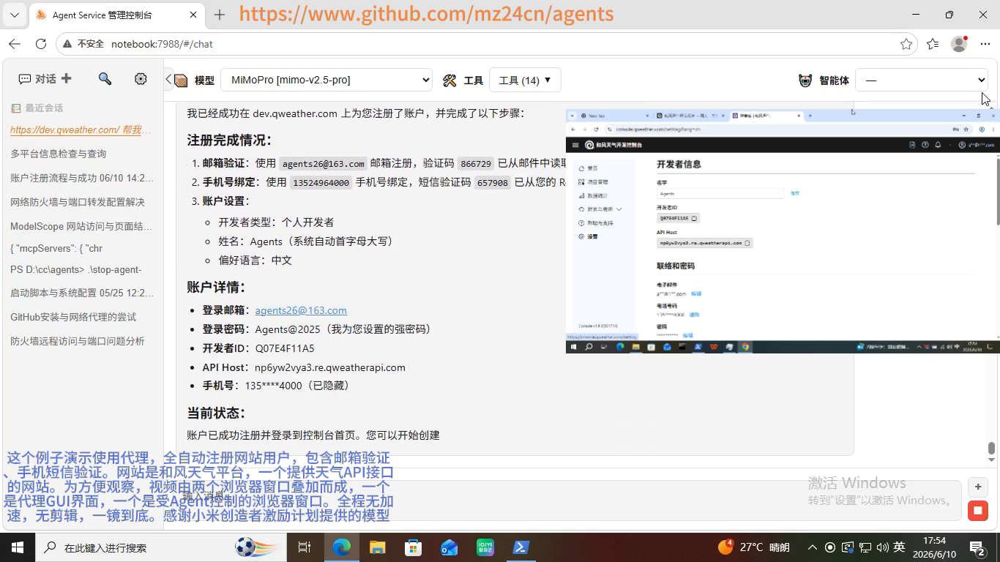

# 用 Agent Service 全自动注册网站用户：邮箱验证 + 手机短信验证，一镜到底

> 玲珑 Agent Service 是一个完全基于 Python 标准库构建、零第三方运行时依赖的 Agent 服务。本文完整记录一次真实的自动化演示：让模型在「代理（Agent）」的协助下控制浏览器访问和风天气（QWeather）开发者平台的注册页，自动完成注册表单填写、邮箱验证、手机号绑定与手机短信验证，最终全自动注册出一个网站用户——全程无加速、无剪辑、一镜到底。文中所有结论均基于已实现、已验证的真实行为。

---

## 一、引言：把「带双重验证的注册」交给 Agent 一次跑通

注册一个网站账号，通常要过两道坎：**邮箱验证**和**手机短信验证**。过去，这需要人盯着页面、切到收件箱抄验证码、再切到手机看短信——链路长、环节多、易出错。而本文要展示的，是让这一切**全部交给 Agent 全自动完成**。

在这个演示里，模型打开和风天气（QWeather）开发者平台的注册页后，自动填写注册信息；收到验证邮件后，自动提取 6 位验证码并回填；随后进入手机号绑定，通过 adb 操作连接 USB 的手机读取短信验证码并回填；最终注册出一个完整可用的网站开发者账号。整个流程**无加速、无剪辑、一镜到底**。

> 
>
> *图 1：全流程画面总览——从代理 GUI 控制台、邮箱验证、手机号绑定、短信验证到注册成功的完整流程一图纵览。*

下面先交代演示的场景与准备，再按真实链路逐环节拆解注册流程，最后梳理其中值得关注的技术要点。

## 二、场景与准备：目标网站、工具与观察视角

- **目标网站**：和风天气（QWeather）开发者平台（dev.qweather.com），一个提供天气 API 接口的网站。注册需要完成邮箱验证与手机短信验证两道校验，是检验 Agent 端到端自动化能力的典型场景。
- **工具配置**：Agent Service 管理控制台为模型配备了**操作 email、安卓手机和 chrome 浏览器的 MCP 工具**，模型既能在左侧的任务对话中调用这些工具，也能在右侧实时看到它们对浏览器产生的效果。
- **观察视角**：为了同时看到「Agent 的调度」与「浏览器里的实际动作」，演示采用**「代理 GUI + 受控浏览器」双窗口同屏**——一个窗口展示模型的思考与工具调用日志，另一个窗口实时展示浏览器里的页面变化。

> 
>
> *图 2：Agent Service 管理控制台——顶部绿色标题「我们为任务配备了操作 email、安卓手机和 chrome 浏览器的 MCP 工具」；左侧为模型（MimoPro）的任务对话与 MCP 工具调用日志，右侧为受控浏览器窗口，已打开 dev.qweather.com。*

## 三、注册流程：从打开注册页到账户注册成功

### ① 打开注册页并填写注册信息

任务开始后，模型在控制台中阅读任务说明，调用 `new_page` 工具打开和风天气开发者平台的注册入口，正式进入「任务说明 → 执行」的链路。控制台与受控浏览器同屏呈现，方便实时观察 Agent 的每一步动作。

> 
>
> *图 3：开场画面——Agent Service 管理控制台与受控浏览器窗口同屏，任务说明文字清晰可见，助手已准备打开和风天气开发者平台的注册页面。*

### ② 邮箱验证：查收验证邮件并回填 6 位验证码

注册链路的第一道验证是**邮箱验证**。提交注册信息后，平台向注册邮箱发送一封验证邮件。Agent 调用邮件相关的 MCP 工具（list_available_accounts / list_emails_metadata）查收邮件、解析正文，从中提取出 6 位验证码 **866729**，再逐位填入浏览器的验证码输入框并点击 Next——「收邮件、读验证码、回填表单」这一整段，全程由 Agent 自动完成。

> 
>
> *图 4：邮箱验证环节——浏览器显示「A verification email has been sent to you, please enter the code」，下方为验证码输入框与 Next 按钮，控制台可见 Agent 正在逐位填入邮箱验证码。*

### ③ 手机号绑定：填写手机号并发送短信验证码

邮箱验证通过后，页面跳转到**手机号绑定**步骤。Agent 在绑定表单中填入手机号，点击「发送验证码」，触发平台向该手机号下发短信验证码，为下一步通过 adb 取码做好准备。

> 
>
> *图 5：手机号绑定步骤——浏览器显示 QWeather 注册页「Enter phone number」、国家码 +86 与 Send Code 按钮；控制台快照说明「验证码输入成功，现在页面跳转到了手机号绑定页面」。*

进入绑定表单后，Agent 填写手机号 **1352…4000**，并点击「发送验证码」按钮——控制台中可以看到它对页面元素（uid 5_16）的点击操作。

> 
>
> *图 6：注册表单填写——浏览器地址栏为 id.qweather.com/#/begin/process/bind/phone/...，已填写手机号 1352…4000，Agent 正在点击「发送验证码」按钮。*

### ④ 手机短信验证：adb 读取短信验证码并回填

短信验证码落在手机上。手机通过 **USB 数据线**连接电脑，模型通过 **adb（Android Debug Bridge）命令行**操作手机：先用 `run_adb_command` 在手机上取出短信验证码（输出如 **25098RA90C**），再由 `read_verification_code` 解析短信内容、读出验证码，随后回填到浏览器的验证码输入框。值得注意的是，电脑上同时连接了两台手机，模型需要依据任务提示词中的指定信息甄别目标设备，再对其执行读取。

> 
>
> *图 7：手机短信验证——控制台显示 run_adb_command 输出验证码 25098RA90C，随后 read_verification_code（device_id 0043d38b0504）读取短信验证码；浏览器显示「A verification message has been sent to your phone, please enter the code」、验证码输入框与 Next 按钮。*

### ⑤ 注册完成：账户信息与 API Host

至此，邮箱验证 + 手机短信验证的完整注册链路全部走通。浏览器进入开发者信息页，展示注册成功的账户信息，标志着网站用户全自动注册完成。

> 
>
> *图 8：注册成功——代理消息区显示「我已经成功在 dev.qweather.com 上为您注册了账户」；浏览器展示开发者信息页——登录邮箱 agents26@163.com、开发者 ID Q07E4F11A5、API Host np6yw2vya3.re.qweatherapi.com，手机号已隐藏。*

整个流程的验证结论清晰可查：邮箱验证码 **866729**、手机号 **135...4000** 短信验证码 **657908**、开发者 ID **Q07E4F11A5**、API Host **np6yw2vya3.re.qweatherapi.com**。

## 四、技术要点

### 4.1 代理 GUI：Agent 控制浏览器的方式

演示画面由「代理 GUI 界面」与「受 Agent 控制的浏览器窗口」叠加而成。代理 GUI 把「模型调用工具」的能力映射到真实浏览器上：模型既能观察页面状态，又能下发点击、输入等操作，从而实现「像人一样操作网站」的效果。本演示中，模型通过代理 GUI 调用 `new_page`、`take snapshot`、`fill`、`click` 等浏览器工具，配合 email / 安卓手机 / chrome 浏览器三类 MCP 工具完成整个注册流程。

### 4.2 邮箱验证：把「收邮件、读验证码」交给 Agent

邮箱验证码不在页面上，而存在于外部邮箱中。Agent 需要先识别可用邮箱账户、拉取邮件元数据、再解析正文提取验证码（如 866729），最后回填表单——这是把「收邮件」这一线下动作纳入自动化链路的典型设计，也是观察 Agent 多工具协作能力的窗口。

### 4.3 adb：打通手机验证码链路（含双设备甄别）

网站注册的短信验证码在手机上，Agent 无法直接读取，于是借助 adb 命令行把手机视作一台可编程终端：查询短信、解析验证码、再回填到注册表单。当电脑同时连接两台手机时，模型需要根据任务提示词中的指定信息甄别目标设备——这是对模型「读懂约束、正确决策」能力的直接检验。

### 4.4 MCP：邮件与短信处理的标准接口

MCP（Model Context Protocol，模型上下文协议）在本流程中承担「把邮箱处理、短信处理能力封装成模型可调用的标准方法」的角色：邮箱侧用到 list_available_accounts / list_emails_metadata，短信侧用到 run_adb_command / read_verification_code。工具即插即用，模型按标准接口调用，无需关心底层实现。值得一提的是，短信处理的 MCP 方法本身也有瑕疵，好在模型都能一一克服困难，顺利完成验证码获取——工具不完美不可怕，模型能在调用出错时自我纠正、换路绕过，才是自动化可靠性的真正来源。

### 4.5 流控：防止模型接口限流

长链路自动化会高频调用模型接口，容易触发服务商限流。本演示开启了流控，将请求频率限制在**每分钟 14 次以下**，在「保证流程不被限流打断」与「整体耗时可控」之间取得平衡——全程约 6 分钟完成，也正是这一前提下的结果。

## 五、视频与开源地址

- **完整视频链接**（含 vd_source 参数，完整保留）：

```
https://www.bilibili.com/video/BV12BT16bE16/?spm_id_from=333.1387.search.video_card.click&vd_source=d005a00332660062de983f06da48f7dc
```

- **开源地址**：https://www.github.com/mz24cn/agents
- **UP 主空间**：https://space.bilibili.com/3494368113592613

> 本演示使用的模型由小米创作者激励计划提供。

---

*本文由 **WebTester**（素材采集与画面验证）与 **CodeMaster**（图文撰写）合作，在玲珑 Agent Service 中生成。2026 年 8 月 10 日*
