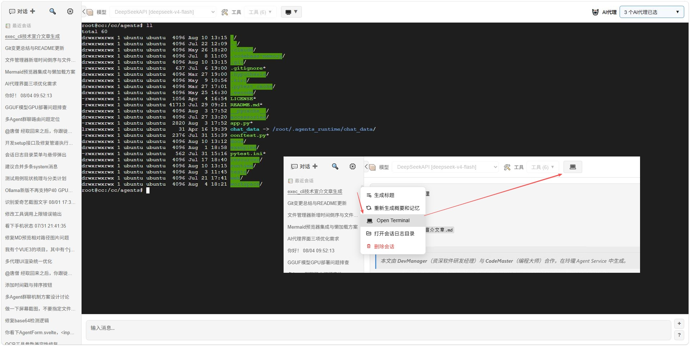
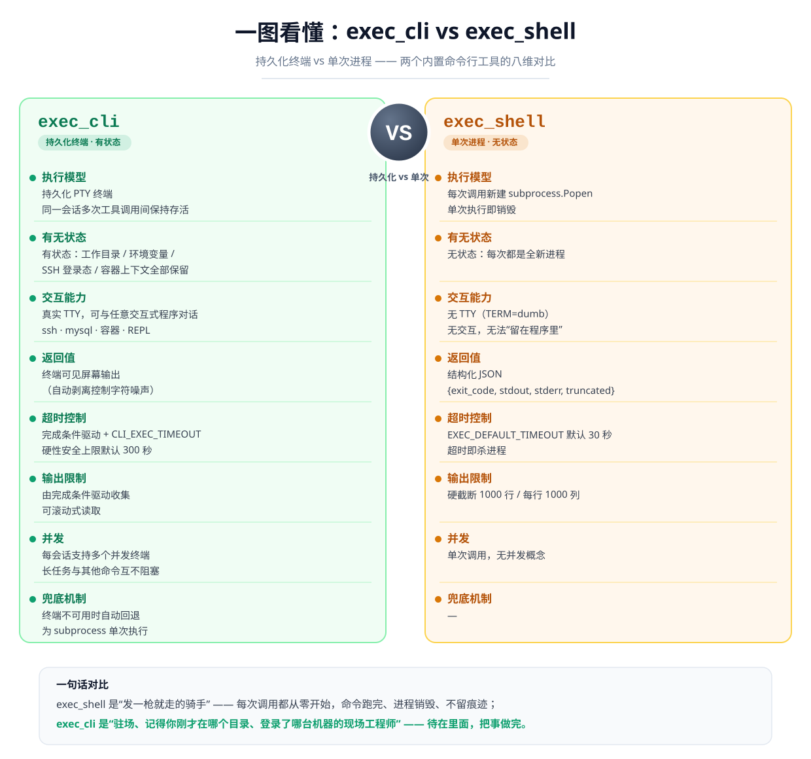
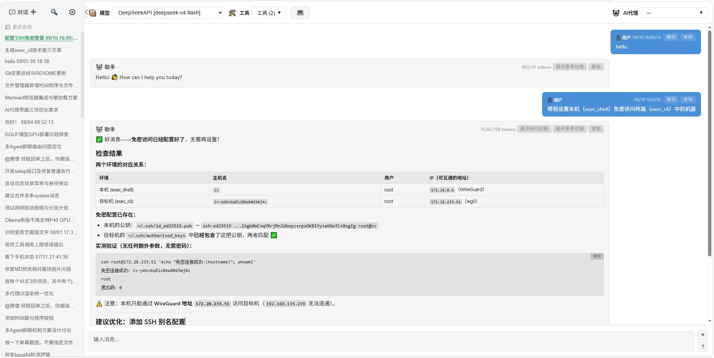
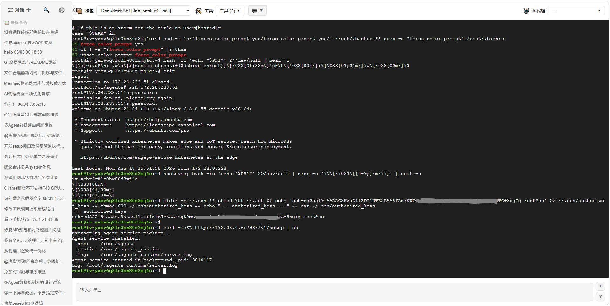

# exec_cli：让 Agent "坐进终端"——玲珑 Agent Service 的持久化命令行工具

> 玲珑 Agent Service 是一个完全基于 Python 标准库构建、零第三方运行时依赖的 Agent 服务。本文聚焦它的内置工具 `exec_cli`：一个把"会敲命令的 Agent"升级为"能现场值守、能钻进任何环境、能与交互式程序共事"的关键能力。文中所有结论均基于已实现、已测试的真实行为。

---

## 一、引子：Agent 的"手"与"在场"

大多数 Agent 的"执行命令"能力，都建立在**按单次调用方式执行**的一次性子进程模型之上：调用一次、运行一个命令、回收输出、进程随即销毁，下一次调用又从零开始。这套模型简单可靠，但对需要"进入一个环境并一直待在里面"的任务无能为力——它登录不了远程主机、进不了容器、连交互式程序的密码提示都应付不来。

玲珑 Agent Service 内置的 `exec_cli` 工具恰恰补上了这块拼图。它不是又一个一次性执行器，而是 Agent 与**持久化 PTY 终端会话**之间的通道：终端在同一个会话的多次工具调用之间保持存活，环境变量、工作目录、已启动的前台进程、SSH 登录态全部延续。借助它，Agent 可以像人类工程师一样，登录远程主机、进入容器、与任何命令行程序对话，完成复杂的现场诊断与调试。

> 
>
> *Agent Service 聊天界面：`exec_cli` 与 `exec_shell` 均作为内置工具在对话中直接可用。*

---

## 二、一图看懂：exec_cli vs exec_shell

`exec_shell` 是典型的"单次调用"执行器：每次调用都新建一个 `subprocess.Popen`，命令在非交互模式（`TERM=dumb`、无 TTY）下运行，进程结束后返回结构化 JSON，无任何状态留存。`exec_cli` 则相反，它连接的是按会话持久化的终端。

| 维度 | `exec_cli` | `exec_shell` |
|---|---|---|
| **执行模型** | 连接**持久化 PTY 终端**，同一会话的多次工具调用间保持存活 | 每次调用新建 `subprocess.Popen`，单次执行即销毁 |
| **有无状态** | 有状态：工作目录、环境变量、前台进程、SSH 登录态、容器上下文全部保留 | 无状态：每次都是全新进程 |
| **交互能力** | 有真实 TTY，可与任意交互式程序对话（ssh、mysql、容器等） | 无 TTY（`TERM=dumb`），无交互能力，无法"留在程序里" |
| **返回值** | 终端**可见屏幕输出**（自动剥离控制字符噪声） | 结构化 JSON：`{exit_code, stdout, stderr, truncated}` |
| **超时控制** | 由完成条件 + 硬性安全上限 `CLI_EXEC_TIMEOUT`（默认 **300 秒**）共同决定 | 默认 `EXEC_DEFAULT_TIMEOUT`（**30 秒**），超时即杀进程 |
| **输出限制** | 由完成条件驱动收集，可滚动式读取 | 硬截断 1000 行 / 每行 1000 列 |
| **并发** | 每个会话支持**多个并发终端**，可一个终端跑长任务、另一个终端继续干活 | 单次调用，无并发概念 |
| **兜底机制** | 终端不可用时**自动回退**为 subprocess 单次执行 | — |

**一句话对比**：`exec_shell` 是"发一枪就走的骑手"，`exec_cli` 是"驻场、记得你刚才在哪个目录、登录了哪台机器的现场工程师"。

> 
>
> *一图看懂：`exec_cli`（持久化终端）与 `exec_shell`（单次进程）的八维对比。`exec_cli` 适合需要保持状态、TTY、交互、长时间值守的任务；`exec_shell` 适合一次性、无状态的快速命令。*

两个工具各司其职：一次性、无状态的快速命令用 `exec_shell`；需要保持状态、需要 TTY、需要交互、需要长时间值守的任务，用 `exec_cli`。

---

## 三、参数逐个说

`exec_cli` 共 5 个参数，全部围绕两个问题展开：**"往终端发什么"** 与 **"何时算收集完成"**。

| 参数 | 必填 | 说明 | 推荐用法 / 技巧 |
|---|---|---|---|
| `command` | ✅ | 发送到持久化终端的命令/输入 | 传**空字符串**时不发送任何输入，仅读取最新终端进度——适合轮询长任务的最新输出 |
| `cwd` | 可选 | 命令工作目录（**仅对 shell 命令生效**） | 实现上包装为 `cd <目录> && <命令>`；对 ssh、mysql 等交互式程序不生效 |
| `prompt_pattern` | 可选 | 正则表达式，**匹配到可见终端输出**即完成收集 | 建议**先观察命令提示符，再用其前缀作为匹配模式**，如 `\$`、`#`、`user@host:~$` |
| `idle_timeout` | 可选 | 无新输出的毫秒数后返回（默认 `1000`；设为 `0` 禁用） | 适合"命令跑完就不再有输出"的场景；对持续刷新的程序（如 `top`）需谨慎 |
| `read_after_delay` | 可选 | 读取该毫秒数后**无论有无输出**都返回（默认 `0`，禁用） | 适合"只读固定时长窗口的输出"——如采样一段日志或交互程序的瞬时反馈 |

### 完成条件：谁先满足谁生效

- `prompt_pattern` 匹配到 → 立即返回；
- `idle_timeout` 到期且（有已收集输出或未发送命令）→ 返回；
- `read_after_delay` 计时到 → 无论有无输出都返回；
- 三者之上还有一道**硬性安全上限**：环境变量 `CLI_EXEC_TIMEOUT`（默认 300 秒）。它不是工具参数，而是环境变量级的安全网——即使命令在跑、输出在滚，到达上限也会强制返回并报告超时，防止 Agent 被一条卡死的命令永久挂起。

> 环境变量速查：`CLI_EXEC_TIMEOUT`（默认 300s，exec_cli 硬上限）、`EXEC_DEFAULT_TIMEOUT`（默认 30s，exec_shell 默认超时）、`OUTPUT_CHECK_INTERVAL`（默认 0.05s，终端输出轮询间隔）。

---

## 四、不止 shell：持久化终端 = 一切命令行

`exec_cli` 的名字容易让人误以为它只是"换了个方式跑 shell 命令"。实际上，持久化终端的能力边界远不止 shell：

- **它是一条真正的 TTY**。底层通过 `get_or_create_terminal` 获取/创建持久化 PTY：非 Windows 平台使用 `pty` / `fcntl` / `termios` / `select` 派生真实伪终端；Windows 平台则用 `winpty` 拉起 PowerShell。因此它对交互式程序完全"隐形"——**程序以为自己在跟真人对话**。
- **它可以覆盖一切命令行操作**。数据库客户端（`mysql` / `psql` / `redis-cli`）、容器 CLI（`docker exec`、`kubectl`）、SSH 会话、`node` / `python` REPL、`vim`、调试器、交互式安装向导……凡是你会在终端里干的事，Agent 都能在 `exec_cli` 里做。
- **它甚至可能支持交互操作**。因为始终连在同一个 PTY 上，Agent 可以"问一句、答一句"：程序提示输入密码 → `exec_cli` 发密码；程序给出选项菜单 → `exec_cli` 敲序号；命令卡住等待确认 → `exec_cli` 回车或按 `Ctrl-C`。
- **输出经后台线程持续排空到缓冲区**，Agent 可以随时用空 `command` 把最新进度读回来，不必等到程序退出。
- **支持每会话多个并发终端**：在一个终端里跑长驻进程（如开发服务器），在另一个终端里继续执行其他命令，互不阻塞。
- **终端不可用时自动降级**：当某上下文拿不到终端会话时，`exec_cli` 会回退为 subprocess 单次执行，保证工具永远"能用"，只是失去持久化能力。

> 诚实说明能力边界：交互程序的行为取决于程序本身是否支持非交互输入（如部分程序要求密码必须由 tty 输入），以及 `CLI_EXEC_TIMEOUT` 的硬约束——这些是工程设计上的权衡，而非缺陷。

---

## 五、典型用法：SSH 登录远程主机 → 进入 Docker 容器 → 现场诊断

把上面这些能力串起来，就是 `exec_cli` 最具杀伤力的场景：**逐层进入受限环境做现场诊断**。下面以"本地 Agent 通过 SSH 登录远程主机，再进入一个无法访问公网的容器进行调试"为例（命令与提示符按常规发行版展示，实际以目标环境为准）。

### 第 1 步：SSH 登录远程主机（登录态保持）

```json
{
  "command": "ssh ops@10.0.1.20",
  "prompt_pattern": "\\$",
  "idle_timeout": 3000
}
```

```text
// 终端可见输出（示意）
Welcome to Ubuntu 22.04 LTS ...
Last login: Mon Jul 29 10:12:33 2024 from 10.0.1.2
ops@prod-host-01:~$
```

观察远程主机的命令提示符（如 `ops@prod-host-01:~$`），用其前缀作为 `prompt_pattern` 的匹配模式。若目标主机要求密码/密钥口令，Agent 可再用 `exec_cli` 发送对应输入；配合预置的 SSH 密钥则全程免交互。**一次登录后，后续所有调用都在这条持久化会话里执行，不需要重复认证。**

### 第 2 步：进入隔离容器（无法访问公网的现场环境）

```json
{
  "command": "docker exec -it web-app-01 /bin/bash",
  "prompt_pattern": "#",
  "idle_timeout": 3000
}
```

```text
// 终端可见输出（示意）
root@web-app-01:/app#
```

容器内是典型限制性环境：**无公网访问、无外部工具链**，无法"装个 agent 再进来"。但 Agent 的能力跟随持久化终端一起**进入了容器**，现场诊断即刻可用。

### 第 3 步：容器内现场诊断（多轮调用，状态持续）

```json
{ "command": "ps aux | grep -E 'java|nginx' | head -20" }
{ "command": "df -h && free -m" }
{ "command": "tail -n 50 /app/logs/app.log" }
{ "command": "curl -s -o /dev/null -w '%{http_code}' http://127.0.0.1:8080/health" }
{ "command": "ss -tlnp | head -20" }
```

```text
// 终端可见输出（示意，节选）
root@web-app-01:/app# ps aux | grep -E 'java|nginx' | head -20
root       123 /usr/bin/java -Xmx2g -jar /app/app.jar
root     1402 nginx: master process nginx -g daemon off;

root@web-app-01:/app# curl -s -o /dev/null -w '%{http_code}' http://127.0.0.1:8080/health
503

root@web-app-01:/app# ss -tlnp | head -20
LISTEN  0  4096  127.0.0.1:8080  users:(("java",pid=123,fd=123))
```

多轮调用共享同一终端上下文：刚才 `cd` 到哪个目录、导出了哪些环境变量、登录的是哪台主机——**全部保留**。若命令仍在后台运行，可用 `"command": ""` 仅读取最新进度。由于容器不能访问公网、也没有调试工具链，传统做法是"人肉"登进去手动敲命令；而在这里，Agent 全程自主完成了"登录 → 进入容器 → 定位进程 → 验证端口 → 查看日志 → 判断故障点"的完整闭环，过程中**不需要任何一次人工干预**。

### 第 4 步：逐层退出（可选）

```json
{ "command": "exit", "idle_timeout": 500 }
```

---

## 六、为什么这在限制性环境中价值极高

受限环境（内网、无公网出口的容器、隔离的跳板机网络、生产堡垒机）恰恰是自动化工具最容易失灵的地方：云端 Agent 连不进去、外部 API 触达不到、一键脚本也装不进去。`exec_cli` 用最朴素的方式解决了这个问题——**它本身只需要一个能执行命令的终端，而终端是这类环境几乎唯一一定存在的东西**：

1. **无需在目标环境预装任何 Agent 组件**。只要有一条 SSH 通道、能起一个 shell，Agent 的全部能力就随之进入。
2. **能力不随环境缩水**。进去之后，文件读写、代码搜索、进程与网络排查、日志分析、数据库操作照常可用，与在本地毫无二致。
3. **更进一步：让 Agent 本体"入驻"现场**。结合自安装脚本 `/v1/setup`，Agent 甚至能把"自己"搬进远程环境：在远程机器上执行

```bash
curl -s http://{host}:7988/v1/setup | sh
```

这条命令把 Agent Service 源码、已编译 Web UI 与运行配置一次性导出并安装到目标机器（Windows PowerShell 用 `irm http://{host}:7988/v1/setup | iex`），使 Agent Service 本身成为部署在远程环境的**完全自主的远程助手**，以极低成本操作任意可连接的环境。此时 `exec_cli` 不只是"手"，而是把 Agent 的"大脑"也搬到了现场。

> 
>
> 
>
> *在授权设置中导出带短时效 token 的 `/v1/setup` 安装命令，即可把 Agent 本体部署到目标机器。*

---

## 七、结语：能力半径的扩展

最终，`exec_cli` 把"Agent 的能力半径"从"本机的一次性命令"扩展为"任意可连接环境中的持续在场"。如果说 `exec_shell` 是 Agent 伸出的一只手，那么 `exec_cli` 就是让 Agent **坐进那台机器的终端里**——登录、进入、驻留、排查，像一位随叫随到的运维工程师。

配合 `/v1/setup` 自安装脚本，它甚至可以把自己部署到远程环境，成为完全自主的远程助手——**以极低成本，操作任意可连接的环境**。凡是人类工程师能 SSH 进去的环境，`exec_cli` 都能把 Agent 带进去。

---

*本文由 **DevManager**（资深软件研发经理）与 **CodeMaster**（编程大师）合作，在玲珑 Agent Service 中生成。2026年8月9日*
