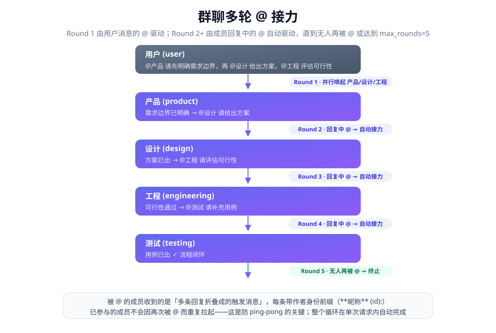
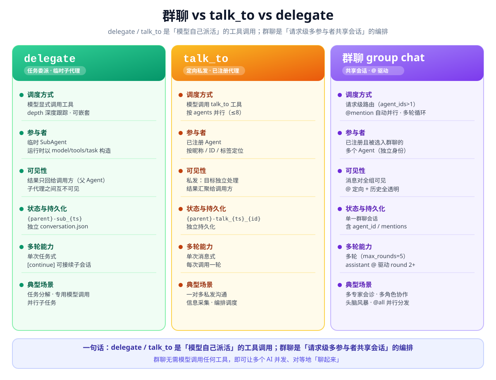
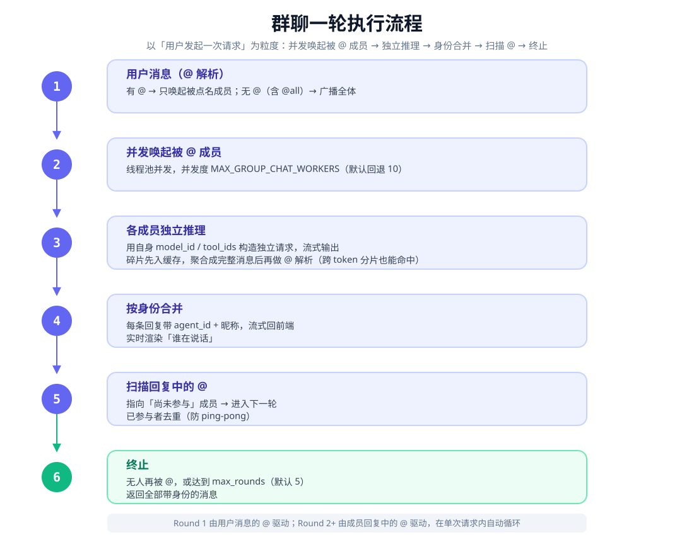

# 群聊机制：让多个 AI 真正"聊起来"——@mention 驱动、多轮接力与身份追踪

> 玲珑 Agent Service 是一个完全基于 Python 标准库构建、零第三方运行时依赖的 Agent 服务。本文聚焦它的**群聊（group chat）机制**：多个已注册的 AI 代理共享同一会话，通过 `@昵称`/`@AgentID`/`@all` 定向唤起与广播，回复中的 `@` 自动驱动下一轮接力，每条消息携带独立身份并在单一会话中持久化——让多个 AI 从"被单点调度的工具"变成"能对等讨论的一群人"。文中所有结论均基于已实现、已测试的真实行为。

---

## 一、引言：从"工具式委派"到"对等协作"

在引入群聊之前，玲珑 Agent Service 让多个 AI 协作的方式主要有两种：

- **delegate（任务委派）**：由模型自己调用一个工具，把一段任务交给一个临时构造的子代理，子代理用自己的模型与工具跑完后，把结果以字符串形式交还给调用方。它是"**派活**"——单向、任务式，子代理之间互不可见。
- **talk_to（定向私发）**：由模型调用工具，把一条消息私发给一个或多个指定代理，各代理独立处理后把结果汇聚回调用方。它是"**私发**"——目标代理只见自己的任务，看不到群里其他人的发言。

这两种方式各有用武之地，但都有一个共同的缺口：**没有"一群人坐在同一个房间里"的对等讨论**。结果只回给调用方、参与者之间互不可见、无法形成"你质疑我、我反驳你"的多轮交锋、也没有一条贯穿始终的共享会话记录。

群聊机制正是为补上这一缺口而生，它提供了四样核心的"群"语义：

- **共享会话**：所有参与者读的是同一条会话历史，中间产物与理由在同一处累积，可追溯；
- **对等可见**：每个成员的发言对全组可见，谁在什么上下文里对谁说了什么，一目了然；
- **@ 驱动**：消息里点名谁谁响应，不点名则广播全组，定向与广播自由切换；
- **多轮接力**：成员回复中的 `@` 会自动拉起尚未参与的人，一轮接一轮，直到无人被点或达到轮次上限。

一句话概括定位：**delegate / talk_to 是"模型自己派活"的工具调用；群聊是"请求级多参与者共享会话"的编排**——后者无需模型调用任何工具，就能让多个 AI 并发、对等地"聊起来"。

---

## 二、群聊机制速览：核心能力清单

群聊不是某个单一接口，而是一整套"共享会话 + 定向唤起 + 多轮接力 + 身份追踪"的能力组合，核心能力如下：

| # | 能力 | 说明 |
|---|---|---|
| ① | **多智能体共享同一会话** | 请求携带 `agent_ids: [≥2]` 即进入群聊路由，所有参与者在同一条会话中读写 |
| ② | **@mention / @all 定向唤起与广播** | `@昵称`/`@AgentID` 点名唤醒；`@all`（或 `@everyone`）广播全体；不 @ 默认广播全组 |
| ③ | **回复中的 @ 自动驱动下一轮** | 成员回复里 `@` 到未参与者即自动进入下一轮（round 2+），已参与成员去重不重复拉起（防 ping-pong），轮次上限 `max_rounds`（默认 5） |
| ④ | **独立模型与工具，并行推理** | 每个成员用自己注册的 `model_id`/`tool_ids` 构造独立推理请求，由线程池并发调度、流式返回 |
| ⑤ | **身份追踪** | 每条消息携带 `agent_id` 与昵称；从某成员视角看，他人发言折叠为 `**昵称** (agent_id):` 前缀的 user 消息，前端按头像/昵称渲染 |
| ⑥ | **单一会话持久化** | 全部消息（含 `agent_id`/`mentions`）落在同一个 `conversation.json`，回到会话自动恢复多选状态与完整历史 |

---

## 三、如何启用群聊

### 3.1 前置条件：注册 ≥2 个 Agent

群聊的参与者必须是**已注册的 Agent**。在 Agent Service 管理控制台（或 `agents` 目录）为每个 Agent 配置以下字段：

| 字段 | 说明 | 是否必填 |
|---|---|---|
| `model_id` | 该成员使用的模型，群聊中独立生效 | 必填 |
| `tool_ids` | 该成员可调用的工具集，群聊中独立生效 | 必填 |
| `nickname` | 成员昵称，用于 `@昵称` 解析与身份显示 | 必填 |
| `system_prompt` | 成员自身人格/职责设定，与群聊框架叠加 | 可选 |
| `labels` | 标签（可多个），用于成员分组展示与 `@标签` 解析兜底 | 可选 |

每个成员在群聊里都用**自己的**模型与工具独立推理——这正是"多专家各持一套技能"能成立的前提。

### 3.2 入口：前端多选与 API 路由

群聊的触发条件只有一个：**请求体携带的 `agent_ids` 数量大于 1**。

- **前端入口**：聊天页的 Agent 选择器（`AgentSelector`）支持多选——`Ctrl/Cmd + 点击` 切换选中，界面显示 `N agents selected`；选中后模型/工具选择被禁用（群聊走各 Agent 自带配置）。从历史会话恢复时，多选状态与成员列表也会一并还原。
- **API 入口**：调用 `POST /v1/infer` 或 `POST /v1/infer/stream`，body 携带 `agent_ids` 数组（≥2 个）即进入群聊路由，无需任何额外开关：

```json
{
  "agent_ids": ["product", "design", "engineering", "testing"],
  "messages": [
    { "role": "user", "content": "@product 请先明确这个需求的边界，再 @design 给出方案，@engineering 评估可行性。" }
  ],
  "stream": true
}
```

首次发起群聊（新会话）时，服务端会注入一份**共享的群聊 system 提示**作为会话的根系统消息，后续各成员在此基础上叠加自身配置。

### 3.3 输入语法：@昵称 / @AgentID / @all

- `@昵称`：用成员昵称点名，如 `@安全专家`；
- `@AgentID`：用 Agent ID 点名，如 `@security-expert`（兜底精确）；
- `@all`（或 `@everyone`，不区分大小写）：广播给全体参与成员；
- **不 @ 直接发送**：默认广播给所有参与者。

前端输入框在键入 `@` 时弹出已选成员菜单，支持键盘导航（`↑/↓`、`Enter`、`Esc`）与光标定位，选中后自动插入 `@昵称 `。解析时按"昵称 → Agent ID → 标签"的顺序在参与成员内查找，未知名字被忽略，成员去重且保持首现顺序。

### 3.4 多轮：回复里的 @ 自动接力

群聊不止一轮。首轮由用户消息的 `@` 决定唤起谁；此后，**成员回复中出现的合法 `@` 指向"尚未参与"的成员时，会自动进入下一轮**，该成员收到的"当前消息"是被 @ 到它的多条回复折叠成的触发消息（每条带作者身份前缀）。已经参与过的成员不会因再次被 @ 而重复拉起——这是防 ping-pong 的关键。整个过程在单次请求内自动循环，直到**无人再被 @** 或达到 `max_rounds`（默认 5）轮上限。

> 
>
> *图 1：多轮 @ 接力示意——Round 1 由用户消息的 `@` 并行唤起多位成员，Round 2+ 由成员回复中的 `@` 自动接力，直到无人再被 `@` 或达到轮次上限。*

### 3.5 从零开一个群聊：最小步骤清单

1. **注册 ≥2 个 Agent**：在管理控制台配置好各自的 `model_id`、`tool_ids`、`nickname`（`system_prompt`、`labels` 可选）。
2. **打开聊天页并多选**：在 Agent 选择器里 `Ctrl/Cmd + 点击` 选中 ≥2 个成员（或从历史会话恢复）。
3. **输入**：键入 `@` 唤起成员菜单，`@某成员` 定向点名；若不 @ 直接发送，则广播给所有成员。
4. **发送并观察接力**：每个成员带昵称流式回复；若某成员在回复里 `@` 了未参与者，自动进入下一轮（最多 `max_rounds=5` 轮）。
5. **回到会话继续**：会话历史（含 `agent_id`/`mentions`）从 `conversation.json` 自动恢复，多选状态同步还原，可随时接着聊。

---

## 四、群聊 vs talk_to vs delegate：三种多智能体协作方式

三种方式并存，覆盖不同的协作形态，核心差异如下：

| 维度 | delegate | talk_to | 群聊 |
|---|---|---|---|
| **调度方式** | 模型显式调用工具，`depth` 深度跟踪，可嵌套 | 模型调用 talk_to，按 `agent_ids` 并行（≤8） | 请求级路由（`agent_ids>1`），@mention 自动并行，多轮循环 |
| **参与者** | 临时 SubAgent（运行时以 model_id/tools/task/context/images 构造） | 已注册 Agent（按昵称/ID/标签定位） | 已注册且被选入群聊的多个 Agent |
| **可见性** | 结果只回给调用方（父 Agent），组内不可见 | 私发：目标独立处理，结果汇聚给调用方 | 消息对全组可见，@ 定向 + 历史全透明 |
| **状态与持久化** | 子会话 `{parent}-sub_{ts}`，独立 conversation.json | 子会话 `{parent}-talk_{ts}_{id}`，独立持久化 | 单一群聊会话，所有消息（含 `agent_id`/`mentions`）在同一 conversation.json |
| **多轮能力** | 单次任务式；`[continue]` 可接续子会话 | 单次消息式（每次调用一轮） | 多轮（`max_rounds=5`），assistant @ 驱动 round 2+，身份追踪 |
| **上下文** | 调用方给 context + task + images | 目标自身 system_prompt + 排除自己的 AGENTS 调度表 | 每 Agent 独立组装：自身 prompt + 群聊框架 + AGENTS 表 + 全历史 + `[群聊]` 标记 + 回追提示 |
| **典型场景** | 任务分解、专用模型调用、并行子任务 | 一对多私发沟通、信息采集、编排调度 | 多专家会诊、多角色协作、头脑风暴、@all 并行分发 |

**一句话总结**：delegate / talk_to 是"**模型自己派活**"的工具调用（任务式/私发式，结果回流给调用方）；群聊是"**请求级多参与者共享会话**"的编排（对等、透明、@ 驱动、可多轮），无需模型调用任何工具即可并发发起效。

> 
>
> *图 2：三种多智能体协作方式对比——delegate/talk_to 是「模型自己派活」的工具调用，群聊是「请求级多参与者共享会话」的编排。*

---

## 五、优势场景：群聊独有的价值

### 5.1 多专家会诊 / 评审（multi-expert review）

代码审查、方案评审、安全审计——每位专家 Agent 持有独立的 `system_prompt` 与工具（如安全 Agent 使用扫描工具），用户一句 `@安全 @性能 @可维护性` 即可并行点名，专家各自独立评审；专家之间还能互相 `@` 质疑（如 `@性能 你漏了 X`），形成对等辩论。

**群聊独有的价值**：delegate 是"单向交结果"，无法对等讨论；talk_to 私发，其他专家看不到质疑上下文；群聊的跨 Agent 可见 + 自动 round 2+ 让评审结论在单一会话里闭环。

### 5.2 多角色协作流水线（multi-role pipeline）

产品、设计、工程、测试四个角色共同推进一个需求：`@产品` 定需求 → 产品 `@设计` 出方案 → 设计 `@工程` 评估可行性 → 工程 `@测试` 出用例，`@` 接力形成完整决策链。

**群聊独有的价值**：所有中间产物与理由在同一会话累积、可回溯；每个角色用自己的模型与工具；talk_to 只能私发，无法保留"谁在什么上下文里对谁说了什么"的链条。

### 5.3 @all 并行分发（fan-out）

一个任务需要多个独立产出时（如"给同一份代码分别做重构建议、文档、测试用例"），`@all` 一次性唤起全体成员并行执行，并发度由 `MAX_GROUP_CHAT_WORKERS` 控制。

**群聊独有的价值**：相比 talk_to"私发后结果拼成一串返回给调用方"，群聊里每个成员的产出直接进入共享会话并带身份头像，可被后续 `@` 继续加工；比 delegate 少一层模型决策（无需模型决定怎么派活）。

### 5.4 头脑风暴（brainstorming）

`@all` 让每个 Agent 各提几个点子，随后互相 `@补充/反驳/投票`，多轮积累观点。

**群聊独有的价值**：`[群聊]` 标记区分"旁观 vs 被点名"的延迟可见性，接近真实微信群；身份前缀（`**昵称** (id):`）让观点可归因；比 delegate/talk_to 更贴近"一群 AI 真的在一起聊"。

### 5.5 教学 / 演示（teaching & demo）

用群聊直观展示多智能体协作——端到端测试里就有"孙悟空/沙僧/八戒"的三人群聊剧本，每个 Agent 独立人格（`你是孙悟空。`），`@` 触发轮转、防 ping-pong、3 轮链式触发。

**群聊独有的价值**：演示场景里群聊的"可见性"本身就是卖点——观众能看到每个 Agent 的独立回复与 @ 接力，这是 delegate 内部黑盒式委派做不到的。

### 5.6 角色扮演（role-play）

成员表显式声明用户行"在角色扮演中属于第三人视角"，每个 Agent 持自身角色卡（`system_prompt`），用户 `@角色A 开始` 驱动剧本推进。

**群聊独有的价值**：共享可见性让角色之间可以互相回应（A 说的话 B 能看到并可回应），多轮持续推进剧情；talk_to 私发无法形成"在场"感。

---

## 六、设计细节：一轮群聊是怎么跑起来的

### 6.1 一轮的执行流程

以"用户发起一次请求"为粒度，一轮群聊的执行流程如下：

> 
>
> *图 3：一轮群聊执行流程——从用户消息的 `@` 解析到并发唤起、独立推理、身份合并、扫描 `@` 直至终止。*

各环节的责任划分可以浓缩为一张表：

| 环节 | 触发方式 | 并发/产物 | 关键点 |
|---|---|---|---|
| **Round 1** | 用户消息的 @ 解析 | 有 @ 只唤点名成员，无 @ 广播全体 | 用户消息的 `mentions` 被记录 |
| **Round 2+** | 成员回复中的合法 @ | 仅唤起"尚未参与"的成员 | 多条回复折叠成一条触发消息，带作者身份前缀 |
| **终止** | 无新 @ 或达 `max_rounds=5` | 返回全部消息 | 已参与成员去重，不重复拉起 |

### 6.2 上下文组装：每个成员看到什么

群聊的关键难点在于：**同一个群，每个成员看到的视角不同**。服务端为每个成员独立组装推理上下文，包含以下层次：

1. **自身 system prompt（或模板）**：优先用成员自己的 `system_prompt`/`prompt_template`，并与群聊框架叠加；
2. **群聊框架提示**：默认框架是一份共享的群聊 system 提示，向成员说明"这是一场群聊对话"以及 `@` 的使用方法：

```text
这是一场群聊对话，以下是参与本次对话的AI代理：
{{AGENTS}}

在消息中使用 @ 符号提及某位AI代理时，可以使用它的昵称；
在 `talk_to` 工具中向某几位AI代理发送消息时，`agents` 须使用他们的 Agent ID。
```

3. **参与成员表（AGENTS）**：一张 `| Nickname | Agent ID | Description |` 表格，包含全部参与者与一个固定的用户行（示意）：

```text
| Nickname | Agent ID | Description |
|---|---|---|
| 安全专家 | security-expert | 资深安全审计专家，持有扫描工具 |
| 性能专家 | perf-expert | 专注性能优化与压测分析 |
| 用户 | user | 在群聊中代表用户。在角色扮演中属于第三人视角 |
```

4. **完整历史（按成员视角重排）**：只有该成员自己的 assistant 消息保持 `assistant` 角色；其他成员的输出折叠为 `**昵称** (agent_id):` 前缀的 user 消息（若对方调用了工具，会追加"（调用了工具a,b,c）"一行说明）；真实用户消息带 `**用户** (user):` 前缀。这样每个成员都"看得懂"别人的发言，又清楚哪些话不是自己说的；
5. **`[群聊]` 标记**：非 @ 某成员的用户消息加 `[群聊]` 前缀，帮助它区分"旁观 vs 被点名"——模拟微信群里"没被 @ 也能看到，但知道那不是叫我"的延迟可见性；
6. **缺席回追提示**：若某成员在 N 轮被定向 @ 的对话中缺席，会插入一条回追消息："📢 群聊回追：在你未 @ 参与期间共有 N 轮对话。以下为完整历史记录，其中标注 [群聊] 的消息并非 @ 你，供参考上下文。" 让它快速补上上下文。

### 6.3 持久化与会话恢复

群聊的"群"属性同样体现在存储上：

- **单一会话**：全部消息（含 `agent_id`/`mentions`）落在同一个 `conversation.json`，与单 Agent 会话同一套持久化机制，无需独立子会话；
- **会话标题**：取首条用户消息的前 30 字；
- **流式合流**：流式碎片经合并后一路携带 `agent_id`/昵称/`mentions` 写入会话记录，身份信息不丢失；
- **恢复**：回到该会话继续发消息时，历史从磁盘自动重建，前端也从 `meta.agent_ids` 恢复多选状态，群聊可随时"接着聊"。

### 6.4 超时与连接保活

群聊每轮并行等待的外部 deadline 不是固定的 `MODEL_INFER_ROUND_TIMEOUT`（默认 900s），而是**按群聊人数放大**：

```
群聊每轮 deadline = len(all_agent_ids) × MODEL_INFER_ROUND_TIMEOUT
```

- `all_agent_ids` 只包含 AI 成员（用户是固定的 `**用户** (user):` 行，不在其中）——正好是"去除用户外的 agent 数"。
- 为什么要放大：`MODEL_INFER_ROUND_TIMEOUT` 在 `infer_stream` 内部是"**每一轮工具调用**"的 wall-clock 上限、每轮重置；一个 Agent 做多轮工具调用时，总时长可以合法地超过单轮上限。若群聊外层也卡死在同一个值，做多轮工具调用的 Agent 会被误杀，报 `Error: agent inference timed out after ...`。
- 超时守卫仍可通过把 `MODEL_INFER_ROUND_TIMEOUT` 置空/≤0 整体关闭（此时群聊等待不受限）。

另外，群聊等待期间（健康成员已回复完、只剩慢成员时）SSE 连接会长时间没有数据，容易被网关/代理/防火墙的 idle timeout 掐断——断连后后端写错误帧会静默失败，错误只在历史回放中出现。因此群聊等待循环会**每 ~25s 发送一条 SSE 注释帧（`: keepalive`）保活**；注释帧被前端解析器天然忽略，前端无需任何改动。

---

## 七、现状与展望

### 7.1 现状：基本可用

群聊机制目前已具备完整的端到端能力，并有自动化测试持续守护：端到端测试覆盖中英文昵称解析、按昵称/ID 解析、round 2 触发、无效 mention 不触发、身份前缀而非用户前缀、流式分片聚合、3 轮链式触发、防 ping-pong 等用例；`mentions` 的持久化也有独立测试。**从"单轮群发"到"多轮对等对话"的主体功能已经落地，可直接使用。**

### 7.2 展望：几个值得改进的方向

客观地说，机制"基本可用，仍有改进空间"。以下按改进价值排序，列出代表性方向：

1. **@ 解析对代码场景的误判**：目前的 @ 提取规则较为朴素，邮箱地址（`user@example.com`）、装饰器（`@app.route`）、`@import` 等代码文本可能被误判为成员点名，从而误触发下一轮；`@昵称，` 这类后跟标点的情况也可能导致解析失败。更精准的上下文感知解析是明显改进点。
2. **全历史重放的开销与缺少群聊级摘要**：每个成员每次都被注入完整历史（含他人工具/思考的折叠），长会话 token 成本线性增长；目前没有群聊级摘要/裁剪（单 Agent 会话有滚动摘要，群聊尚未复用）。引入"群聊级摘要 + 分层回放"是控制成本的关键方向。
3. **`max_rounds=5` 硬上限与缺少"收敛即停"**：即使 @ 链仍在继续，5 轮即停；也缺少"观点收敛即结束"的自动收尾（例如可在 @all 后追加总结 Agent）。更聪明的终止策略（如按轮内增量/观点重合度判断）值得探索。
4. **单成员失败兜底较粗糙**：某成员推理异常时仅以 `"Error: ..."` 文本消息进入群聊流，无重试/跳过策略，可能污染会话且用户不易区分。更优雅的兜底（失败提示+重试+与会话分离）有待完善。
5. **昵称/标签解析歧义**：成员定位按"昵称 → ID → 标签"顺序查找，当两个 Agent 昵称相同或标签重名时，可能解析到非预期对象。引入唯一性校验或前端在选择时即绑定 ID 可消解歧义。
6. **前端 @ 范围受限**：输入框的 @ 菜单目前只从"已选中的成员"派生，未选中的 Agent 无法在输入时 @，跨群点名的灵活性受限。

以上方向不影响群聊当下的可用性——它们是"让群聊更好用"的下一步，而非"当前不可用"的证据。

---

## 八、演进脉络与开源地址

群聊机制并非一蹴而就，而是从代码实现与提交历史中逐步演进而来，主线大约跨 3 个月（2026 年 4 月 → 8 月）：

```
delegate 任务委派（4/26 引入）
   → 前端多选 + @mention（6/21，入口落地）
   → agent_ids 数据模型（6/21，len(agent_ids)>1 成为群聊路由判定）
   → 多轮 + 身份追踪（7/30，从"单轮群发"升级为"多轮对话"）
   → 用户身份 + round 2+（8/3，助理间 @ 接力、回追提示，群聊语义完整）
```

其中，`delegate` 的引入奠定了"多 Agent 各自独立推理 + 流式 + 子会话持久化"的底层能力；前端多选与 `@` 菜单让入口变得自然；`agent_ids` 数组成为群聊判定的数据基础；多轮循环与身份追踪让"对等会话"真正成立；用户身份与 round 2+ 则补齐了完整的群聊语义。约 3 个月的主线演进中，多轮扩展曾以 WIP 状态推进，随后在后续提交中逐步完善。

> 关于视频：该功能目前暂无视频/图文演示，本文为群聊机制的技术说明文档。

- **开源地址**：https://www.github.com/mz24cn/agents

---

*本文由 **CodeMaster**（图文撰写）在玲珑 Agent Service 中生成。2026 年 8 月 10 日*
