# 远程环境管理与远程执行：一个母端，指挥 N 个 Agent 环境

> 玲珑 Agent Service 是一个完全基于 Python 标准库构建、零第三方运行时依赖的 Agent 服务。本文介绍它的**远程环境管理与远程执行**能力：把「一台机器上的 Agent」变成「一个母端 + 一群子端」的运行时集群——母端集中管理子环境（并行状态检查、一键推送增量更新），任意聊天会话可绑定某个子端远程执行（推理留在母端、工具在子端运行），直连 HTTP 与 WS 反向隧道两种传输自动覆盖苛刻的网络条件。文中所有结论均基于已实现、已测试的真实行为。

---

## 一、引子：Agent 的"手"被困在一台机器里

再强大的模型，Agent 的"手"和"眼"也默认只长在一台机器上：`exec_shell`、`write_file`、持久化终端、工作区文件管理器——这些工具只能作用于**本进程所在的那台机器**。当现实需求变成下面这样时，单机模型就撑不住了：

- **Agent 运行时环境不止一台**。通过自安装脚本 `/v1/setup`，你可以在多台机器上各装一个 Agent Service——有的带 GPU、有的贴着内网业务系统、有的只是某个受限网络里的跳板。但它们的版本漂移、在线状态、更新推送，缺乏统一的管理手段：逐台 `curl`、逐台看版本，既繁琐又不可靠。
- **生产网络条件苛刻**。NAT、办公内网、单向可达是常态；母端（指挥中心）甚至可能**没有公网地址**、甚至**匿名**（未设密码，只监听 localhost）。"子端主动去母端拉取"或"母端必须能被子端访问"之类的单向假设，在这些拓扑里经常失效。

本特性的回答是：**母端/子端（parent/child）模型 + 两种传输 + 远程执行**。

- **母端**集中管理所有子环境：添加、并行状态检查、一键推送增量更新；
- **两种传输**覆盖两种单向可达拓扑——子端有可达地址时用**直连 HTTP**；子端在 NAT/内网后、只有"子端能访问母端"这一条路时，用 **WS 反向隧道**（子端主动外呼母端并注册）；
- **远程执行**让任意聊天会话绑定某个子端：推理（模型与会话历史）留在母端，而该会话的**全部工具**——shell、文件、终端、工作区——都跑在子端。

---

## 二、一图看懂：母端子端总体架构

> 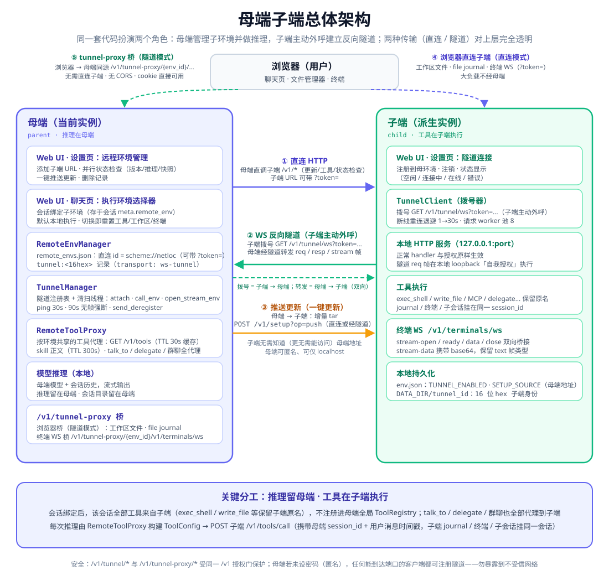
>
> *母端子端总体架构：母端集中管理 N 个子环境，直连 HTTP 与 WS 反向隧道两种传输并存；会话绑定子端后，推理留在母端、工具在子端执行。*

先厘清几个核心概念：

- **母端环境（parent）**：你当前正在管理的那台 Agent Service——Web UI 里"当前环境"就是母端。任何一个 Agent Service 都可以成为母端。
- **子环境（child）**：被母端管理的环境，通常是经母端的自安装脚本派生出去的，也可以是任何一台母端能触达（或已反向注册进来）的 Agent Service。
- **`remote_envs.json`**：母端 `DATA_DIR` 下的**本地管理元数据**——每个子环境一条记录（地址、标题、版本快照、推理状态、在线状态等）。与 `env.json` 一样，它**不参与在线更新**（增量包只打包指定的配置文件）、**不参与自解压导出**（安装脚本永远不会把它写进目标机器），也不会同步到其他环境。它是母端的"花名册"，不是运行时配置。
- **两种传输**：
  - **直连 HTTP**：子端有可达地址（公网 / 内网 / VPN），母端直接调用子端的 `/v1/*`；
  - **WS 反向隧道**：子端主动向母端拨号并注册，**没有公网地址的子端也能被母端管理**；
- **远程执行**一句话：**推理留母端、工具在子端**——模型调用与上下文管理发生在母端，每次工具调用被转发到子端执行。

---

## 三、配置母端：远程环境管理

入口在 Web UI 的 **「设置 → 授权设置」页的「远程环境管理」卡片**：输入子端地址即可添加，之后可并行检查所有环境的状态、一键把增量更新推送到所有环境。

> 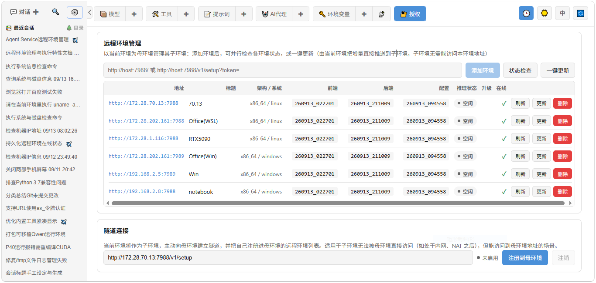
>
> *母端「远程环境管理」卡片：本文实拍集群的 8 个直连子环境——Linux / Windows 混合、不同的地址、版本与在线状态，全部列于同一张表。*

### 3.1 添加环境

地址输入框接受三种 URL 形态（内部会归一化为规范的 setup URL）：

```
http://host:7988/
http://host:7988/v1/setup
http://host:7988/v1/setup?token=...
```

**子端启用授权时，必须使用子端「授权设置」页给出的带 token 完整安装链**（第三形态）：启用授权后 `op=hello` 不再是公共端点，缺少有效 token 的状态检查会被 401 拒绝。添加时母端会先调用目标环境的 `/v1/setup?op=hello` 取版本快照——**hello 成功即视为在线**，快照随记录一起持久化到 `remote_envs.json`。

### 3.2 列表字段

| 字段 | 说明 |
|---|---|
| **地址** | 子端直连地址（隧道环境没有直连地址） |
| **标题** | 子端的 `app_title`（应用名，来自 hello 快照） |
| **架构 / 系统** | 子端的 CPU 架构与操作系统（如 x86_64 / Linux） |
| **前端 / 后端 / 配置** | 版本快照 `frontend_build` / `backend_build` / `last_config`，由状态检查刷新 |
| **推理状态** | `inference_active`：**空闲 / 推理中**（正在跑会话的环境一目了然） |
| **升级** | 母端本地版本比子端新时显示 ⏫——该子端可被推送升级 |
| **在线** | ✓ / ✗。直连环境记录最近一次状态检查的结果；隧道环境由隧道 attach/detach 事件实时驱动（另有 `last_seen` 记录最后在线时间） |

### 3.3 状态检查

「状态检查」按钮**并行**对全部环境发起 hello（等价于同时点击每一行的刷新按钮），逐个刷新版本快照、推理状态与在线状态，并写回 `remote_envs.json`——刷新页面后列表仍显示上一次检查结果。隧道环境的 hello 走反向隧道转发（由子端本地执行、自我鉴权），不需要任何直连路径。

### 3.4 一键更新：推送模型

与"子端去母端拉更新"相反，这里采用**推送模型**：母端在本地以子端版本为基线构建**增量 tar**，直接 POST 到子端的 `/v1/setup?op=push`——**子端无需知道、更无需能访问母端地址**。母端可以匿名、可以只监听 localhost，更新依然成立（这正是场景一的更新路径）。

推送过程的边界处理：

- **版本不高于母端**：直接返回 up-to-date，不推送任何字节；
- **子端正在推理**：推送被拒绝（`inference_active`），避免破坏进行中的会话；
- **子端版本过旧、不认识 `op=push`**：子端返回 400，界面提示"子端过旧，请先升级"（例如重跑一次它的 setup 脚本）；
- **推送成功且包含后端变更**：子端自动安全重启（execv），母端前端轮询等待其 hello 恢复后刷新快照。

「一键更新」按钮对**所有**环境并发推送，全部返回后再统一做一轮状态检查。

#### 前端产物（web/dist）的特殊约定

`web/dist` 里是**内容哈希命名**的产物，增量合并会让旧哈希永久残留，因此约定是**整目录替换**：

- 母端只要判定前端有变化，增量包就带上**完整**的 `web/dist`（而不是只带变化的文件）；
- 子端把新产物先解到 `web/dist` 的兄弟临时目录，校验其中确有 `index.html` 后，再用一次 rename 换上去。

这样任何环节失败（下载被截断、母端产物不完整、旧版母端只带了部分文件）都保持原子目录完好，不会再出现「页面变成 `{"error": "Not found: /"}`」。

`frontend_build` 版本号取自 `web/dist` 中**实际文件的最新 mtime**，而不是只读 `web/dist/build_version` 标记文件：标记文件由 Vite 插件写入，而构建**失败**时它同样会被刷新（`closeBundle` 在报错时也执行，现已改用 `writeBundle`），只信标记会让环境宣称一个磁盘上并不存在的前端版本，进而推送出「只有标记、没有产物」的增量包。当 `web/dist` 缺失、没有 `index.html`、或 `index.html` 引用的产物不存在时，`frontend_build` 上报为空，母端据此判定「可升级」并推来完整产物，从而自动修复这类损坏的环境。

### 3.5 删除

删除只移除 `remote_envs.json` 里的**本地记录**，远端环境的进程与数据完全不动。

### 3.6 隧道环境行

当某个子端经反向隧道接入（见第四节）时，列表会自动多出一条 **id 形如 `tunnel:<16hex>`** 的记录（16 位十六进制是子端生成的隧道身份）。它没有直连地址列的值，用**绿色圆点**表示在线；离线时圆点变灰，在线状态由隧道 attach/detach 事件实时驱动。

> 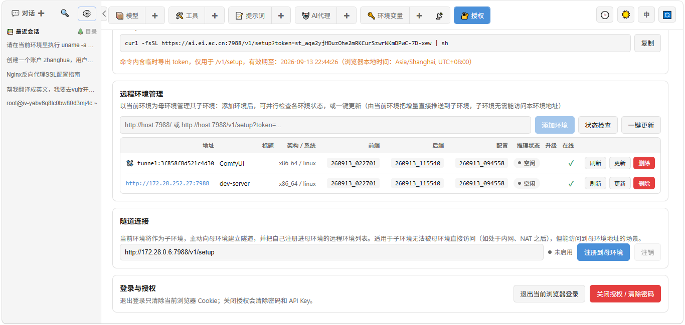
>
> *列表出现第 9 行：隧道环境 `tunnel:8dfd4bfe441d1621`——同一台子端经反向隧道接入母端，无直连地址，绿色圆点表示在线。*

---

## 四、配置子端：隧道连接

适用场景：**子端在 NAT / 内网之后，母端无法直连，但子端能访问母端**。此时在子端侧配置一次"隧道连接"即可。

入口：子端「设置 → 授权设置」页的 **「隧道连接」卡片**。

### 4.1 注册到母环境

1. 在卡片中填入**母环境地址**——它会被保存为环境变量 `SETUP_SOURCE`（与在线增量更新复用同一地址源）；
2. 点击「**注册到母环境**」，子端依次完成：
   - 生成（首次）并**持久化**一个 16 位十六进制的 `tunnel_id`（写入 `DATA_DIR/tunnel_id`，重启不变）；
   - 向母端 `POST /v1/tunnel/register` 登记（**upsert**：同 id 重复注册只更新快照），body 携带 `tunnel_id` 与当前版本快照；
   - 置位 `TUNNEL_ENABLED` 标志，拨号循环启动：持续拨号母端 `GET /v1/tunnel/ws?token=...`（token 取自 `SETUP_SOURCE` 链）。
3. 断线自动重连：指数退避，从 **1 秒到 30 秒**。

### 4.2 注销与删除语义

- **子端「注销」**：向母端发 `DELETE /v1/tunnel/register?tunnel_id=...` 移除记录并断开隧道，同时清除本地 `TUNNEL_ENABLED` 标志；
- **母端侧删除记录**：若子端当时在线，母端会向它发送 `deregister` 帧，子端随即清除 `TUNNEL_ENABLED`；若子端当时离线，则它下次拨号时 hello 会被 `reject (not_registered)`，同样清除启用标志——**被删除的注册不会在子端重启后"复活"**，状态徽章显示「已被母环境移除」，直到用户再次显式注册；
- **同 id 重连防双活**：若同一 `tunnel_id` 已有存活连接，新连接接管、旧连接被 `replaced` 帧断开。

### 4.3 状态徽章

卡片上的状态徽章对应隧道客户端的内部状态：

| 徽章 | 状态 | 含义 |
|---|---|---|
| 未启用 | `idle` | 未注册 / 已注销，拨号循环空闲 |
| 注册中… | `registering` | register 已成功，正在建立数据通道 |
| 连接中… | `connecting` | 正在拨号母端 WS |
| 已连接 | `online` | hello 被 `welcome`，隧道在线 |
| 已被母环境移除 | `unregistered` | 母端无此记录（被删除 / 从未注册） |
| 出错 | `error` | 连接失败详情（地址不可达、被拒绝等） |

---

## 五、工作原理：两种传输，一套数据面

两种传输对上层暴露**同一套数据面**：都是对子端 `/v1/*` 的标准 HTTP 调用 + 对子端本地 WebSocket 端点（终端）的流式桥接。差别只在"字节怎么走到子端"。

### 5.1 直连

- 母端直接调用子端的 `/v1/*`，**token 在 URL 查询参数中**（保留在登记 URL 里，随每次请求携带）；
- 浏览器的远程执行路径同样直连子端：文件 API 与终端 WS 都带 token 查询参数——**大负载（文件上传、终端流）不经过母端中转**。

### 5.2 反向隧道

> 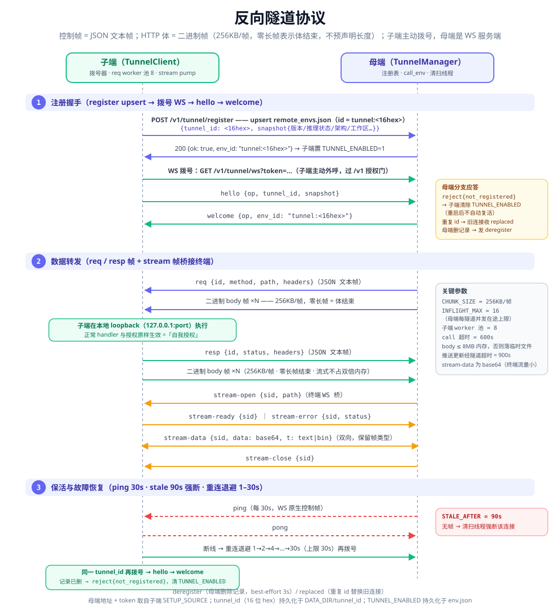
>
> *反向隧道协议时序：register（upsert 登记）→ 子端拨号 WS → `hello{tunnel_id, snapshot}` → `welcome{env_id}`；同 id 重连 → `replaced`；母端无记录 → `reject`；母端删除记录 → `deregister`。*

**注册握手时序**（与上图对应）：

1. 子端 `POST /v1/tunnel/register`（携带 `tunnel_id` + 版本快照，用 `SETUP_SOURCE` 链中的 token 鉴权）→ 母端 upsert 记录并返回 `env_id`；
2. 子端拨号 `GET /v1/tunnel/ws?token=...`，完成 WebSocket 升级——**这是整条链路中唯一一次"子端 → 母端"的主动连接，此后所有流量都跑在这条 WS 上**；
3. 子端发送 `hello {tunnel_id, snapshot}` → 母端核对记录后回复 `welcome {env_id}`，隧道进入在线；
4. 母端查无此 `tunnel_id` → `reject (not_registered)`，子端清除启用标志；
5. 同一 `tunnel_id` 已有存活连接 → 新连接接管，旧连接收到 `replaced` 后断开；
6. 母端删除记录 → 向在线子端发 `deregister`（见 4.2）。

**帧结构**（除 HTTP body 外全部是 JSON 文本帧；body 是二进制帧）：

- **req / resp（HTTP 转发，请求/响应对称）**：文本头帧 `{"op":"req","id","method","path","headers"}`（响应为 `{"op":"resp","id","status","headers"}`），随后是**按 256KB 分块发送的二进制 body 帧**；**零长二进制帧表示 body 结束**——流式传输，不预声明长度；
- **stream（本地 WebSocket 桥接，终端走这里）**：`stream-open`（母端→子端，携带要桥接的本地路径）→ `stream-ready` / `stream-error`（子端→母端）→ `stream-data`（base64 负载，**双向**）→ `stream-close`（**双向**——任一端关闭都会通知对端）。

**保活与自愈**：

- 母端每 **30s** 发送一次**WebSocket 协议级 ping 控制帧**（opcode 0x9，是 WS 协议内置的控制帧，**不是** JSON 应用帧——以代码为准）维持隧道活跃；
- 母端侧 **90s** 收不到任何帧即**强断**该隧道（`STALE_AFTER`）；
- 子端断线后按 **1–30s 指数退避**重拨；子端自身的 WS 读超时为 95s（90+5），因此**母端整体静默时，子端也会自己判定通道死亡并重拨**——两侧都能独立自愈；
- `tunnel_id` 持久化在磁盘，子端重启后自动重拨，隧道自动恢复。

**自我授权（安全核心）**：母端下发的 req 帧由子端在**本地回环 HTTP**（`127.0.0.1:port`）上执行，子端的正常 handler 与授权机制**原样生效**——子端启用授权时，会为自己签发一个会话凭证并附在回环请求上（stream 桥接的握手则附一个短时效 setup token）。结果是：**母端永远不需要存储任何子端凭据**，隧道鉴权只依赖"子端能出示母端认可的 token 来建立这条 WS"这一件事。

**参数速查表**：

| 参数 | 值 | 说明 |
|---|---|---|
| body 分块 | **256KB / 帧** | 每块一个 WS 二进制帧，零长帧结束（流式，不预声明长度） |
| 母端并发 | **16 在途 / 隧道** | 每条隧道最多 16 个并发在途 HTTP 调用（`INFLIGHT_MAX`） |
| 子端执行 | **8 worker** | 子端本地回环执行器的 worker 池（`_WORKERS`） |
| 保活 ping | **30s** | WebSocket 原生 ping 控制帧（非 JSON 帧） |
| 静默强断 | **90s** | 母端侧超过 90s 无帧即关闭该隧道 |
| 重连退避 | **1–30s** | 子端断线重拨，指数退避封顶 30s |
| 隧道调用超时 | **600s** | 隧道上单次 req/resp 转发的默认超时 |
| 隧道推送更新 | **900s** | 经隧道下发增量 tar 的超时 |
| 子端 body 内存 | **≤8MB 留内存** | 子端执行 req 时，body ≤8MB 保留在内存，更大的落临时文件再流式送出 |

---

## 六、使用：远程执行

> 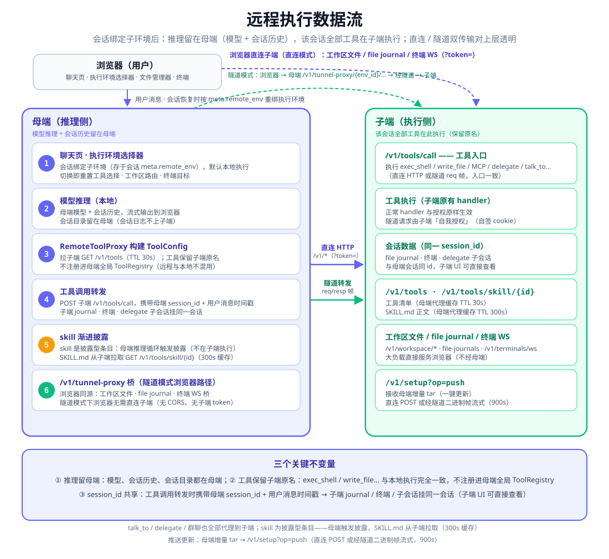
>
> *远程执行数据流：会话绑定子端后，推理（模型 + 会话历史）留在母端；每次工具调用 POST 到子端 `/v1/tools/call`；终端、工作区文件、文件 journal 均作用于子端。*

### 6.1 绑定执行环境

聊天页顶栏有 **「🌐 执行环境」** 选择器：**本地 + 全部子环境**，隧道环境条目带绿色在线圆点。

输入工具条上另有 **「AI 代理」** 选择器：选中某个代理（如「编程大师(本地)」）即自动带好模型与工具，无需手动选择——代理决定"用哪个大脑、带哪些手"，执行环境决定"手伸到哪台机器"，两者正交。

> 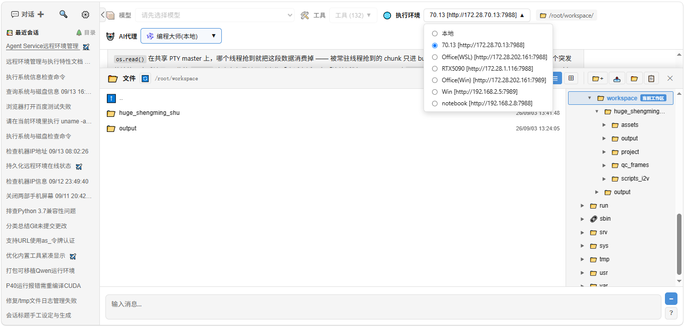
>
> *聊天页「🌐 执行环境」选择器展开：本地 + 8 个直连子端。*

### 6.2 绑定语义

- 会话绑定子端后，该会话的**全部工具**来自子端：工具 ID / 名称保留子端原名（`exec_shell`、`write_file`、`exec_cli`……），**与本地执行观感完全一致**；远程工具不注册进母端全局工具注册表，同一会话内远程与本地工具绝不混用；
- **推理留在母端**：模型调用、会话历史、上下文管理全部发生在母端；
- 每次工具调用被转发到子端 `POST /v1/tools/call`，并携带母端请求上下文中**可移植的部分**（`workspace` / `session_id` / `user_message_timestamp` / `depth` / `agent_id` / `agent_ids` / `all_agent_ids` / `model_id` / `available_tool_ids`），统一编码为 `X-Agents-Request-Context` header 里的**一个 base64url JSON 值**（与 Bearer 认证头同级的传输层上下文；`/v1/tools/call` 的 payload 保持 `tool_id` + `arguments` 的纯工具调用契约）——**子端的文件 journal、终端、delegate 子会话与母端会话同 id**：在子端发生的文件变更，能在母端 UI 里以同一会话追溯。host 相关的 `session_dir`、文件 journal holder 与各服务器单例**由子端按自身重建**，不转发。

- **会话上下文只走 header、绝不放 body**：`X-Agents-Request-Context` 是唯一的传输通道，`POST /v1/tools/call` 的 JSON body 只承载 `tool_id` + `arguments`（直连调用方也一样——把 `workspace` / `session_id` / `user_message_timestamp` 塞进 body 会被忽略，工具只在子端默认工作区里执行）。

### 6.3 截图演示：工具确实在子端跑

> 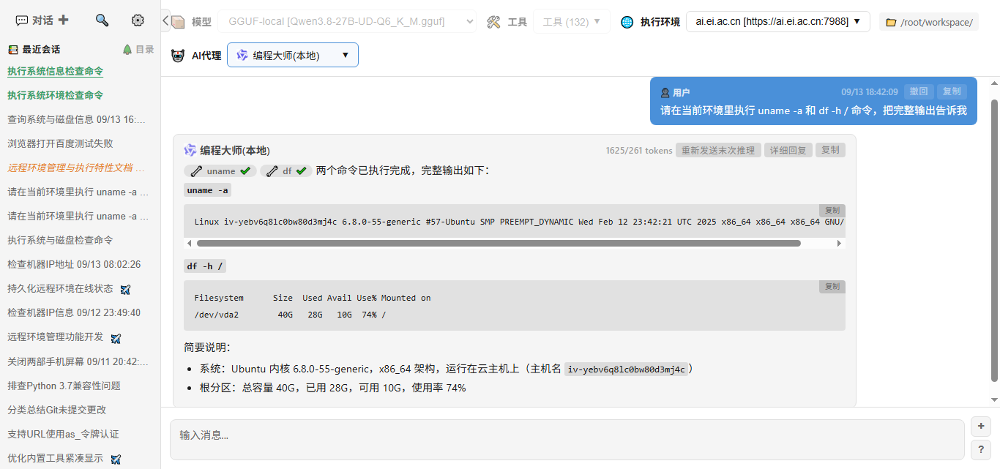
>
> *母端会话绑定公网子端 `ai.ei.ac.cn`（AI 代理「编程大师(本地)」，模型与工具由代理预设）：AI 调用 `exec_shell` 在子端执行 `uname` / `df`——工具胶囊输出中的子端主机名 `iv-yebv6q8lc0bw80d3mj4c` 证明工具确实在子端机器上执行，而非母端。*

### 6.4 远程终端

终端直连子端的 `/v1/terminals/ws`（隧道环境则经母端同源桥接，见 6.6）——**提示符就是子端的主机名**：

> 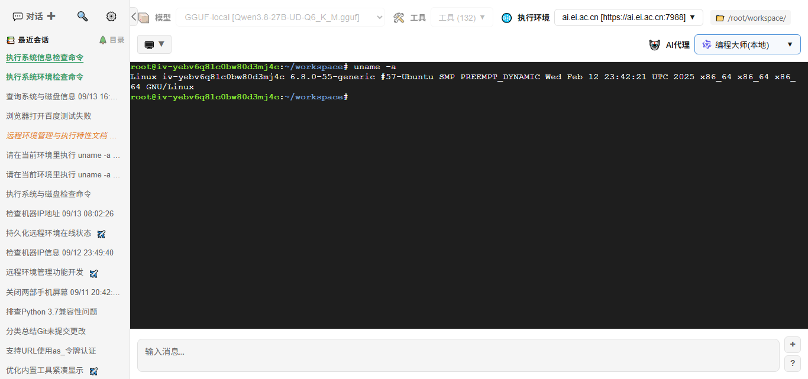
>
> *远程终端：终端实际连接的是子端（提示符为子端主机名），`uname -a` 输出的是子端那台机器的信息。*

### 6.5 工作区文件管理器

绑定子端后，工作区文件管理器指向**子端的默认工作区**（`/root/workspace`）：目录树、搜索、重命名、上传下载全部作用于子端文件，当前工作区徽标标明路由目标。**顶栏徽标与文件管理器始终显示前端设置的会话工作区**（唯一事实来源）：母端推理请求把会话工作区带入母端请求上下文（`_thread_local`），每次工具调用把该值与其他可移植上下文一起、经 `X-Agents-Request-Context` header（base64url JSON 单值）转发到子端（不放进 `/v1/tools/call` 的 JSON payload，payload 保持 tool_id + arguments 的工具调用契约）：目录在子端存在时，`exec_shell` 的 cwd、相对文件路径与持久化终端都固定在该目录，子端执行环境复现母端上下文；不存在时（例如绑定环境时暂不可达、残留了母端路径）子端回退默认工作区（`AGENTS_WORKSPACE` 环境变量，未设置时为进程启动目录）并记录告警日志。**会话日志目录始终在母端**（母端 UI 打开日志目录时会临时锁定本地环境），而子端发生的文件变更通过 file journal 在母端侧可见，子端 journal 条目带有「软链接」入口。

> 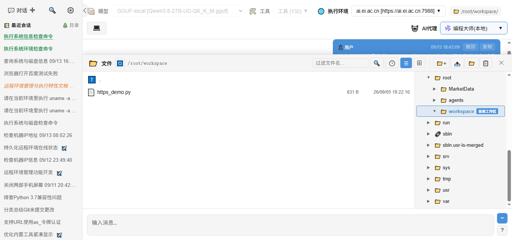
>
> *工作区文件管理器指向子端工作区（`/root/workspace`）：目录树与文件操作全部作用于子端文件，当前工作区徽标标明路由目标。*

### 6.6 能力对齐：不是缩水版

远程执行不是"只能跑 shell"的简化形态，会话级能力完整随迁到子端：

- **talk_to / delegate / 群聊**：子代理与子会话在子端执行，子会话 id 同样挂在母端会话下；请求上下文里的 `depth` / `agent_id` / `agent_ids` / `all_agent_ids` 会一并转发，`tool_scope` 由子端按转发的 `available_tool_ids` 在**自身 registry** 上重建（子工具在子端解析）。注意：**agent 名册本身不跨主机同步**，子端需具备与母端一致的 agent 定义，否则 talk_to 在子端解析目标会失败；
- **Skill 渐进披露**：披露由**母端**推理循环触发（子端 `/v1/tools/call` 不执行 skill 条目），`SKILL.md` 正文从子端 `GET /v1/tools/skill/{id}` 拉取并**缓存 300s**；
- **MCP 工具**：以 function 条目形式代理，由子端执行；base64 前后置（把 `base64` 参数里的文件路径读成内容、把过长的 base64 结果落盘换成本机路径）由**母端**负责——子端 `/v1/tools/call` 始终原样执行，其直接 API 调用方拿到的仍是真实 base64，而不是服务器上的文件路径。**路径型 `base64` 参数若只存在于子端**（母端读不到），母端会把 `{"base64": "auto"}` 随 `X-Agents-Request-Context` 转发给子端，由子端用自己的文件系统把该路径读成 base64 后再交给（子端本地）MCP 工具；过长 base64 结果的落盘仍由母端完成；
- **工具列表缓存 TTL 30s**：子端工具集变化（如隧道重连、推送更新后）会在 TTL 过期时自动失效刷新；
- **浏览器数据路径**：
  - **直连** = 浏览器直连子端（token 只出现在 URL 查询参数 / header 中，大负载不经过母端）；
  - **隧道** = 母端同源 `/v1/tunnel-proxy/{env_id}/...` 桥（含终端 WS 桥接）——**浏览器只与母端说话**，cookie 同源、无 CORS 问题。

---

## 七、典型部署场景

> 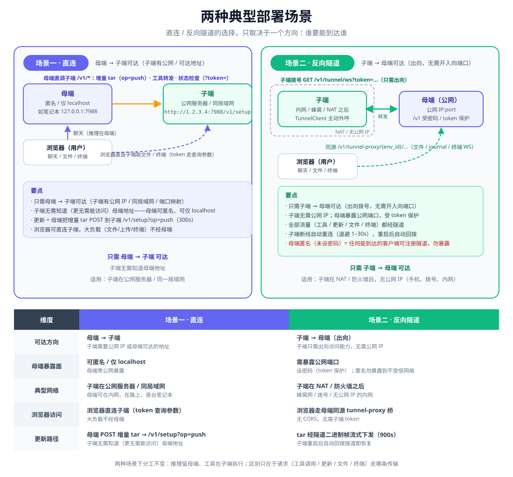
>
> *两种典型部署场景对比：场景一（直连——母端匿名 / 内网，子端有可达地址）与场景二（反向隧道——公网母端 + 内网子端）。*

### 7.1 场景一：直连（母端匿名 / 内网 + 子端可达）

母端在内网、甚至只监听 localhost，未设密码（匿名）；子端有公网或可达地址。**母端推更新、做远程执行，子端无需能访问母端**——更新方向只依赖"母端 → 子端"这一条单向可达路径。

本文档的实拍集群即此形态：本机母端 + 8 台 Linux / Windows 子端，其中含公网可达的 `ai.ei.ac.cn`（见 6.3 的远程执行截图）。

### 7.2 场景二：反向隧道（公网母端 + 内网子端）

母端公网部署、受 token 保护；子端在 NAT / 办公内网之后，**没有公网地址**（如 `192.168.1.x`），只需能访问母端——子端注册并持续维持隧道，母端经隧道完成管理、更新与远程执行。

> 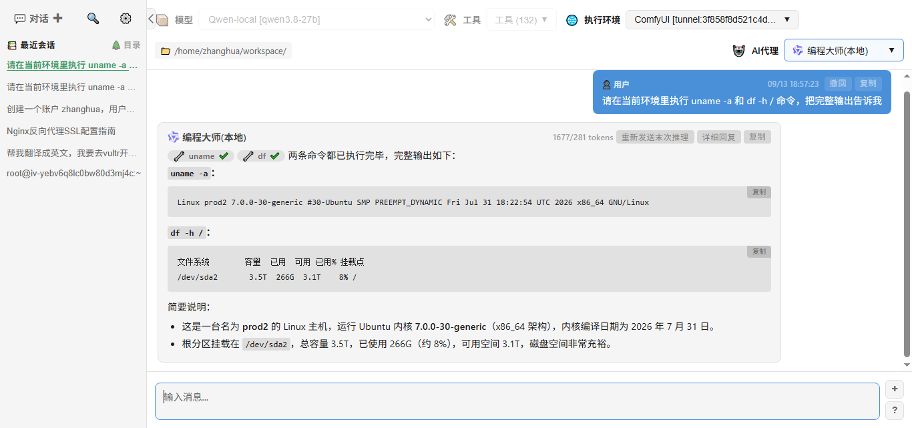
>
> *经隧道对 ComfyUI 子端的远程执行会话：AI 代理「编程大师(本地)」（模型与工具由代理预设），推理在母端，工具调用经反向隧道在 ComfyUI 机器上执行——工具输出中的主机名 `prod2` 即子端主机名。*

以 ComfyUI 子端为例：它坐在办公内网（无公网地址），工作区位于 `/home/zhanghua/workspace`，经隧道接入公网母端 ai.ei.ac.cn 后，母端即可直接对它远程执行、操作其工作区与终端——而它的 GPU 算力与内网位置，正是母端自己所不具备的。

### 7.3 两场景对比

| 维度 | 场景一：直连 | 场景二：反向隧道 |
|---|---|---|
| **可达方向** | 母端 → 子端（单向即可） | 子端 → 母端（子端外呼拨号） |
| **母端暴露面** | 可匿名、可仅内网 / localhost | 需公网可达，**必须启用授权（token）** |
| **子端要求** | 有可达地址（公网 / 内网 / VPN） | 无公网地址亦可，只需能访问母端 |
| **浏览器访问路径** | 浏览器直连子端（token 在 URL 查询参数） | 母端同源 `/v1/tunnel-proxy/{env_id}/...` 桥（cookie 同源、无 CORS） |
| **更新路径** | 母端 POST 增量 tar 到子端 `/v1/setup?op=push` | 同一推送语义，增量 tar 经隧道二进制帧下发（超时 900s） |

---

## 八、安全与边界

- **同门鉴权**：`/v1/tunnel/*` 与 `/v1/tunnel-proxy/*` 与所有 `/v1` API **同门**——父端启用授权时，子端用 `SETUP_SOURCE` 链中的 token 鉴权（register 走 Authorization 头，WS 拨号走 URL 查询参数）；子端侧的「注册 / 注销」操作则走子端自己的浏览器会话授权。
- **自我授权与凭据隔离**：母端**不存储任何子端凭据**——req 帧到达子端后由子端在本地回环上自签会话凭证执行（见 5.2）；浏览器直连模式下，子端 token 只出现在 URL 查询参数 / header 中传递。
- **删除与自愈语义**：`deregister`（母端删除 → 子端清 `TUNNEL_ENABLED`，被删注册不复活）；`replaced`（同 id 重连接管，防双活）；子端 1–30s 退避重拨 + 95s 读超时，断线隧道两侧均可独立自愈。

> ⚠️ **匿名母端风险**：母端未设密码时，**任何能到达其端口的客户端都可以注册隧道，并借母端代理到子端的本地端点**——对已注册的子端，隧道数据面等价于对该子端本地服务的直调。**不要把匿名母端暴露到不受信网络**：要么为母端启用授权（token），要么确保母端端口不可从公网 / 不受信网段到达。

- **已知限制（实测发现）**：子端本地回环调用使用**明文 HTTP**（`127.0.0.1:port`），因此**仅以 TLS 监听（纯 https 部署）的子端无法承载隧道数据流量**——控制链路仍可建立（注册成功、hello 成功、状态显示在线），但 req / stream 转发会失败。此类子端应使用**直连模式**，或让本地回环同时接受明文 HTTP。**直连模式不受此限制影响。**

---

## 九、适用场景与展望

- **AI 代理运行时环境的集群管理**：集中状态检查、版本对比、批量推送更新。它与「自安装脚本」「在线增量更新」三项能力互补：自安装脚本解决"Agent 怎么装到另一台机器"，在线增量更新解决"子端怎么从母端拉更新"，而推送模型解决"**母端无法被子端访问时怎么更新**"——更新方向只依赖母端 → 子端单向可达。
- **苛刻网络条件**：公网母端 + 内网子端（隧道）、内网 / 匿名母端 + 公网子端（直连）——两种单向可达拓扑各归其位，**跨 NAT 不要求双向可达**。
- **集中大脑 + 分布式双手**：母端用强模型做推理，子端提供 GPU、内网系统、特定工作区与本地工具链；子端可深入受限网络执行任务（如场景二中的内网 ComfyUI 子端），母端保持集中指挥——**显著加强了 AI 渗透并操作受限环境的能力**，而指挥面始终收敛在母端一处。
- **与 exec_cli / 自安装脚本的协同**：`exec_cli` 让 Agent 能"坐进终端"与任意受限环境持续对话（SSH、容器、交互式程序），而本特性让那台"终端所在的机器"可以直接是一个子端环境——详见 [exec_cli：让 Agent "坐进终端"](introduce-exec_cli-tool.md)。

---

*本文于 2026 年 9 月 13 日在玲珑 Agent Service 中生成。*
