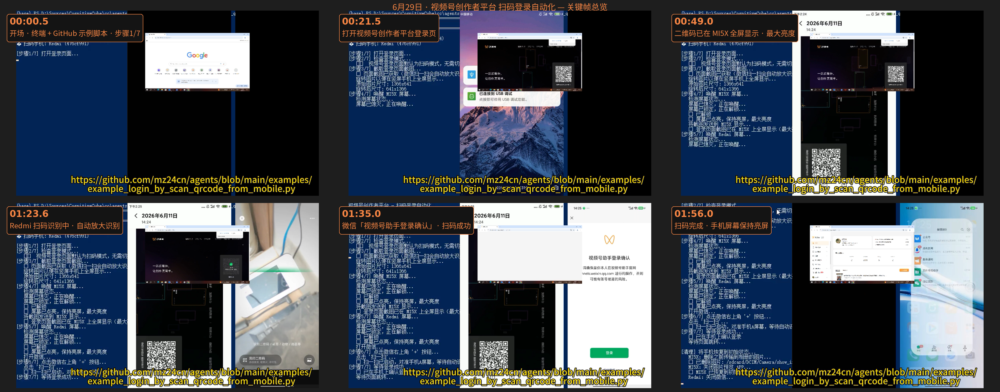
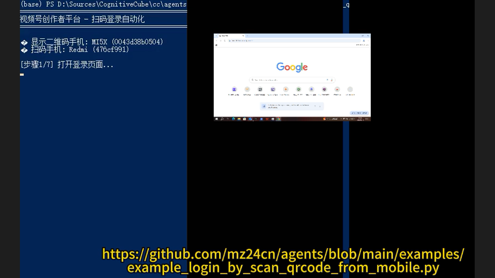
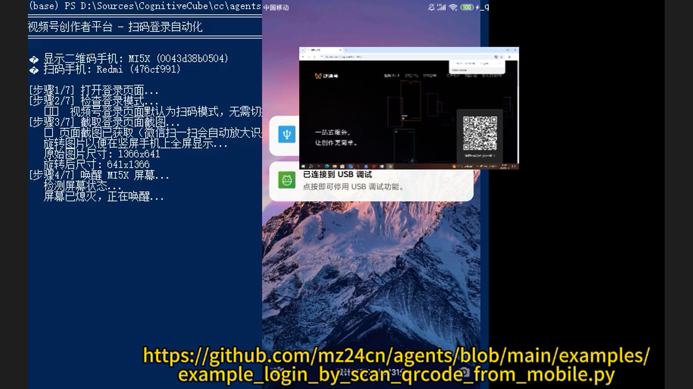
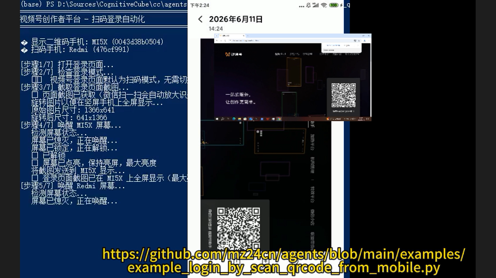
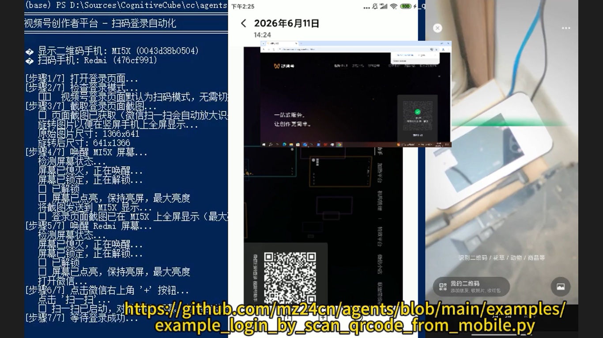
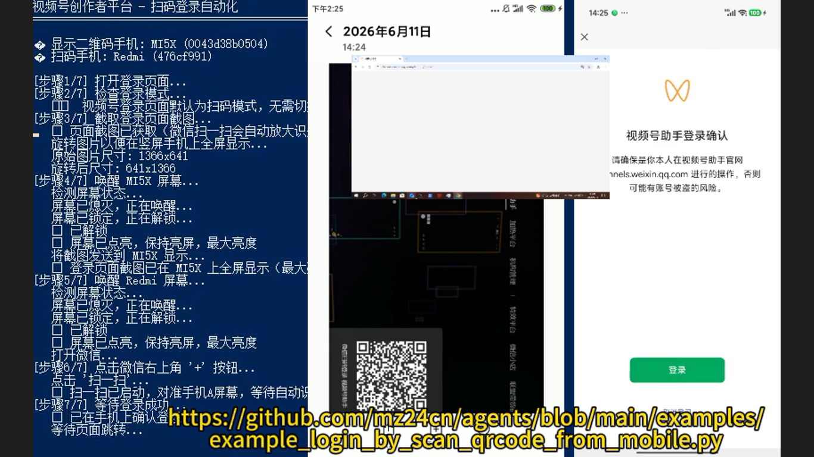
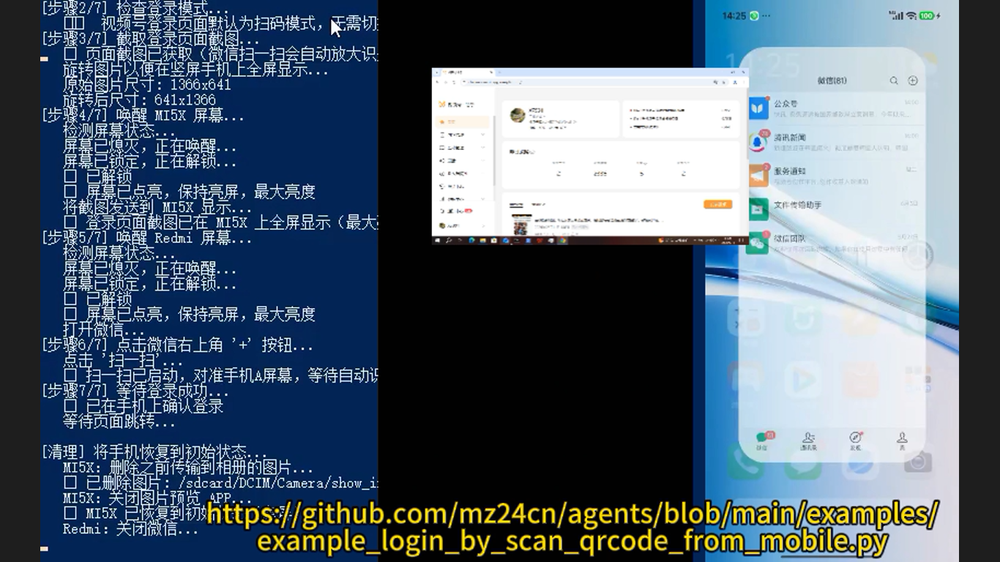

# 用 Agent Service 全自动实现视频号扫码登录：双机方案 + 摄像头物理拍摄 + OCR 定位

> 视频号的 web 平台和抖音、快手、哔哩哔哩等平台不一样，需要**每日扫描登录**，很不方便。本案例借助 Agent Service（https://www.github.com/mz24cn/agents ）以及安卓、OCR、chrome-devtools 等 MCP 工具，用两台安卓手机分工协作——一台（MI5X）全屏显示 web 平台的二维码，另一台（Redmi）操作微信扫码——把微信视频号的每日扫码登录变为全自动。微信扫码比一般 App 扫码有更多限制：禁止从相册获取二维码，在合规要求下只能通过摄像头物理拍摄；微信的 UI 也无法通过 adb 获取结构信息，只能截屏后用 OCR 定位文字或图标按钮位置。本文围绕这一自动化方案本身，呈现其设计思路与完整登录链路。

---

## 一、引言：把「每日扫码登录」这件麻烦事交给 Agent

视频号的 web 平台与抖音、快手、哔哩哔哩等平台不一样，不是登录一次就能长期保持，而是需要**每天重新扫码登录**。对需要频繁维护视频号内容的人来说，这意味着每天早上都要重复一次「打开电脑 → 打开网页 → 拿起手机 → 打开微信扫码 → 手机上确认登录」的流程，繁琐且容易遗忘。

本案例要做的，就是让 **Agent 借助 Agent Service 与 MCP 工具，把这段每日重复的扫码登录全程自动化**。Agent 打开视频号创作者平台的登录页，把二维码推送到另一台手机上全屏显示，再让这台手机用微信「扫一扫」物理拍摄二维码，最后在微信端确认登录，并在登录成功后自动恢复两台手机的初始状态。整个过程不再需要人守在屏幕前，把「每日扫码」变成一行指令即可完成的事情。

> 
>
> *图 1：全流程总览拼图——深色底上以金色标签串联「打开登录页 → 二维码显示与推送 → 另一台手机物理扫码 → 微信端确认登录 → 登录成功与收尾清理」的完整链路，可一览全貌。*

## 二、挑战与约束：微信扫码与微信 UI 的两道特殊门槛

把「微信视频号扫码登录」自动化，难的不是扫码本身，而是微信平台施加的两条特殊约束：

**① 禁止从相册获取二维码，只能摄像头物理拍摄。** 微信扫码和一般 App 扫码不一样，施加了特别限制——禁止从相册中选取二维码图片来识别。也就是说，不能把登录页的二维码截图再传给手机，让手机从相册里读出来；在合规要求下，唯一的路径是让二维码显示在物理屏幕上，由另一台手机的摄像头**真实地拍摄**。这一约束直接决定了本方案必须采用「两台手机」的架构。

**② 微信 UI 无法通过 adb 获取结构信息，只能截屏 + OCR 定位。** 常规的安卓自动化可以借助 adb 读取界面元素树（UI 结构），从而精确地点击某个控件。但微信的界面恰恰拿不到这种结构信息。于是方案退而求其次：对屏幕**截屏**，再用 **OCR** 识别画面中的文字或图标按钮位置，据此确定「扫一扫」入口、确认按钮等该点哪里。

这两条约束叠加，再加上「每天都要重复一次」的固有频率，恰好构成一个能充分体现 Agent 多工具协作能力的典型场景：既要操作网页、又要调度两台手机、还要做图像识别，最后还要负责清理收尾。

## 三、方案设计：Agent Service + MCP 工具 + 双安卓手机

整个方案围绕 **Agent Service**（开源项目，https://www.github.com/mz24cn/agents ）展开。Agent Service 为模型配备了一系列 MCP 工具，把「操作浏览器、操作安卓手机、识别图像文字」等能力封装成标准接口，模型按需调用即可，无需关心底层实现：

- **chrome-devtools（浏览器）MCP 工具**：打开视频号创作者平台登录页、读取页面、截图二维码。
- **安卓（Android）MCP 工具**：连接并控制两台手机——亮屏、唤醒、截屏、点击、打开/关闭应用、传输图片等。
- **OCR MCP 工具**：对截屏结果做文字识别，定位微信界面里的文字或图标按钮位置。

核心架构是**双安卓手机方案**，两台手机各有明确分工：

- **一台（MI5X）**：负责把 web 平台的二维码**全屏显示**，并以**最大亮度**呈现，确保另一台手机的摄像头能清晰、稳定地拍到二维码。
- **另一台（Redmi）**：负责操作微信——打开「扫一扫」、物理拍摄二维码、处理「视频号助手登录确认」弹窗。

把「显示端」和「扫码端」分开，正是为了满足微信「只能摄像头物理拍摄」的合规约束：二维码必须呈现在真实屏幕上，且必须由另一台设备的光学镜头拍摄，而不是在手机内部做「图片传递」。

## 四、自动登录流程：从打开登录页到登录成功与收尾清理

下面按真实链路，把这套自动扫码登录的完整流程拆开来看。

### ① 打开登录页

Agent 收到任务后，先从 GitHub 上的示例脚本 `example_login_by_scan_qrcode_from_mobile.py` 读取步骤说明，明确整条链路的 7 个步骤，其中第一步就是打开登录页面。脚本同时标注了两台手机的分工：MI5X 用于显示二维码、Redmi 用于扫码。随后 Agent 借助浏览器工具打开视频号创作者平台的登录入口。

> 
>
> *图 2：开场画面——终端窗口与 GitHub 上的示例脚本 example_login_by_scan_qrcode_from_mobile.py，步骤 1/7 为「打开登录页面」，并标注两台手机的分工：MI5X 显示二维码、Redmi 扫码。*

### ② 二维码显示与推送

登录页加载后，网页上出现本次登录所需的二维码。Agent 借助浏览器工具对页面进行识别与定位，在二维码上框出识别检测框；随后把二维码图像推送到 MI5X 上全屏显示（此时 MI5X 已通过 USB 调试连接），并调高亮度，为另一台手机的物理拍摄做好准备。

> 
>
> *图 3：视频号创作者平台登录页面展示的登录二维码，手机已通过 USB 调试连接。*

> 
>
> *图 4：二维码已推送至手机全屏显示（日志），另一台手机正在唤醒准备扫码——画面为网页登录页的二维码与识别检测框。*

### ③ 另一台手机物理扫码

二维码就绪后，轮到 Redmi 登场。Agent 唤醒 Redmi、打开微信「扫一扫」，让摄像头的取景框对准 MI5X 屏幕上全屏显示的二维码。由于微信禁止从相册取码，这一步必须是**真实物理手机的画面 + 微信扫一扫取景框**的实拍识别，二维码随即被成功识别。

> 
>
> *图 5：真实物理手机的画面——微信「扫一扫」取景框对准二维码进行识别。*

### ④ 微信端确认登录

二维码识别成功后，微信端弹出「视频号助手登录确认」窗口，等待确认授权。Agent 通过截屏 + OCR 定位确认按钮的位置并点击，完成最后的授权确认，登录随之生效。

> 
>
> *图 6：微信中的「视频号助手登录确认」弹窗，扫码成功待确认。*

### ⑤ 登录成功与收尾清理

确认登录后，本次扫码登录宣告成功。Agent 随即执行收尾清理：恢复手机初始状态——删除本次传输的二维码图片、关闭图片预览与微信等应用，把两台手机还原到任务开始前的样子，整条登录链路至此完整结束。

> 
>
> *图 7：登录成功后的收尾清理——脚本恢复手机初始状态：删除传输的图片、关闭图片预览与微信等，完成整条登录链路。*

## 五、技术要点

### 5.1 MCP 工具：把浏览器、安卓与 OCR 能力统一成标准接口

本方案的自动化能力全部来自 MCP 工具：chrome-devtools 负责网页侧的打开、读取与截图；安卓工具负责两台手机的亮屏、唤醒、截屏、点击与图片传输；OCR 工具负责把截屏转化为可定位的文字坐标。模型按标准接口依次调用，工具即插即用，这正是 Agent Service 把「一套复杂自动化」拆解为「若干可组合能力」的关键。

### 5.2 摄像头物理拍摄：合规约束下的扫码方式

微信扫码不同于一般 App，它禁止从相册获取二维码图片，只能在合规要求下通过摄像头物理拍摄。本方案用 MI5X 全屏、最大亮度地呈现二维码，正是为了让 Redmi 的摄像头能稳定地光学取码——不是「图片的传递」，而是「真实的拍摄」。这一约束直接决定了双机架构的必要性。

### 5.3 OCR 定位：adb 拿不到结构信息时的替代方案

微信的 UI 界面无法通过 adb 获取结构信息，常规的控件树点击失效。方案改为截屏后用 OCR 识别文字或图标按钮的位置，据此定位「扫一扫」、确认按钮等操作点。这也是微信这类封闭界面自动化的通用思路：结构信息不可得时，退而求其次用「看图识字」来驱动。

### 5.4 双机分工与唤醒/亮屏控制

两台手机的分工贯穿全流程：一台专职显示二维码，一台专职扫码。为了让物理拍摄稳定成功，Agent 需要控制扫码机的**唤醒与亮屏**、控制显示机的**亮度**，并在结束前关闭应用、删除临时图片，保证两台设备的状态可进可退、可重复执行。

### 5.5 每日扫码登录的自动化价值

视频号 web 平台需要每日扫码登录，这是平台特性决定的重复性负担。本方案的价值正在于此：把「每天一次、步骤固定、依赖手机+网页协同」的登录，固化成一键执行的自动化任务，彻底解放人力，也为同类「每日重复 + 多设备协同」的自动化提供了可复用的范式。

## 六、视频与开源地址

- **完整视频链接**（保留原始参数）：

```
https://www.bilibili.com/video/BV1vWKD6nEcL/?spm_id_from=333.1387.search.video_card.click
```

- **开源地址**：https://www.github.com/mz24cn/agents
- **UP 主空间**：https://space.bilibili.com/3494368113592613

该短片（BV1vWKD6nEcL）由 UP 主 X7991X 于科技数码分区发布，标签为「短片、原创、剪辑」，页面标注有「AI 生成内容」徽标，内容即上述这套用 Agent 实现视频号自动扫码登录的完整演示。

---

*本文由 **WebTester**（素材采集与画面验证）与 **CodeMaster**（图文撰写）合作，在玲珑 Agent Service 中生成。2026 年 8 月 10 日*
